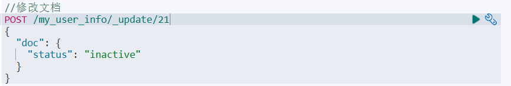
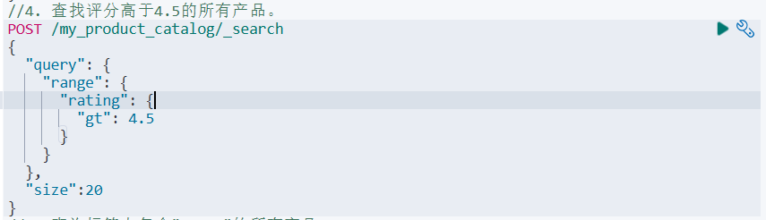
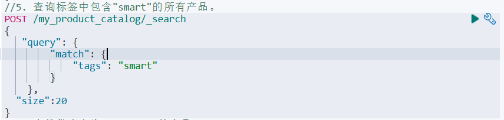
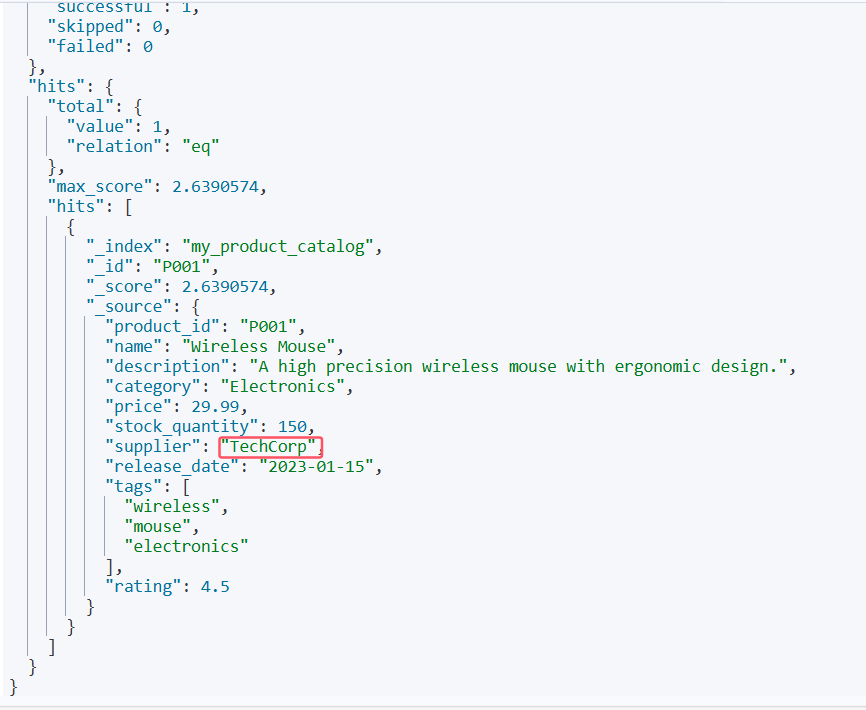
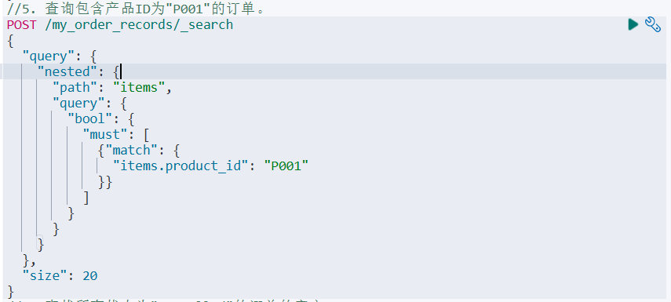
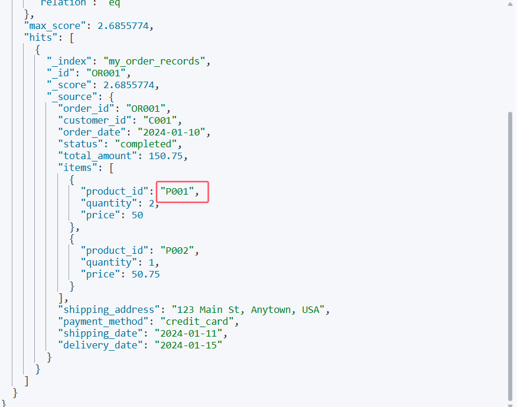
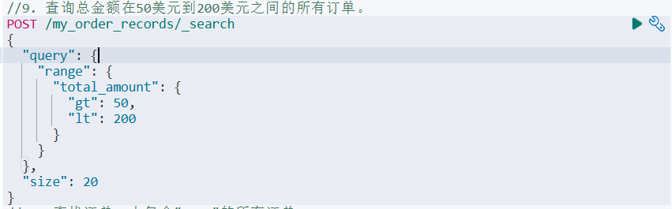

#  Elasticsearch


**学院：省级示范性软件学院**

**题目：**《 实验二：索引&文档操作》

**姓名：**李小龙

**学号：**2200770141

**班级：**软工2202

**日期：**2024-09-28

**实验环境：** elastic


## 一、实验目的

**1.理解并掌握Elasticsearch的安装及插件配置**：

​	学习并实践Elasticsearch的安装和配置，特别是IK分词器的安装，以便在中文环境下能够进行有效的分词处理。

**2.熟练掌握索引操作**：

​	学习如何创建、修改和删除索引，以及根据业务需求进行字段类型和映射的设计与优化。熟练掌握索引管理的相关命令和操作。

**3.掌握文档的基本操作**：

​	学习并练习在Elasticsearch中创建、更新、删除和查询文档的基本操作。通过不同类型的数据操作，理解Elasticsearch文档管理的灵活性和高效性。

**4.深入理解和掌握高级查询与DSL语法**：

​	通过高级查询的训练，掌握DSL（Domain Specific Language）查询语法，并能够根据不同的业务需求设计复杂的查询逻辑。熟悉常用查询方式，如全文检索、条件过滤、聚合分析等。

**5.实践并应用批量导入数据的方法**：

​	学习如何将结构化数据批量导入到Elasticsearch中，提升数据管理的效率。同时在此过程中掌握数据清洗、字段映射的配置与优化。

**6.实际操作与业务场景结合**：

​	通过用户信息、产品目录和订单记录等业务场景的具体操作与练习，理解Elasticsearch在实际业务中的应用价值和实践意义。

**7.提高Markdown撰写技术文档的能力**：

​	通过实验报告的编写，提升Markdown格式的文档撰写能力。将实验过程、操作步骤、结果和分析以清晰、规范的方式记录下来，便于项目展示与交流。


## 二、实验内容

1. Elasticsearch 安装IK分词器。

2. Elasticsearch 索引操作训练。

3. Elasticsearch 文档操作训练。

4. Elasticsearch 高级查询与DSL训练。

   

## 三、实验步骤

#### **1.IK分词器的安装：**

​	首先，进入到Elasticsearch安装目录下的bin目录，然后在文档路径处输入“cmd”，然后执行执行下面命令：

```
elasticsearch-plugin install https://get.infini.cloud/elasticsearch/analysis-ik/8.12.2
```


#### **2.IK分词器的查看：**

​	在elasticsearch-8.12.2/config中可以看到analysis-ik目录则证明安装成功。


#### **3.Kibana的安装（注意要与ES的版本相同）：**

​	打开本门课程的钉钉群聊，在群文件中找到Kibana下载软件包，点击下载。


#### **4.启动Kibana：**

​	首先进入到es的安装目录下的bin目录中，点击运行elasticsearch.bat文件启动elasticsearch，待es启动成功后进入到Kibana的安装目录下的bin目录点击kibana.bat文件运行kibana。


#### **5.创建索引：**

##### 5.1用户信息索引：


*结果展示：*


##### 5.2产品目录索引：


*结果展示：*


##### 5.3订单记录索引：


*结果展示：*


#### **6.修改索引：**

##### 6.1用户信息索引：

​	添加用户的会员等级字段，用于查看用户的会员等级。


*结果展示：*


##### 6.2产品目录索引：

​	添加产品原料字段，用于查看该所使用的原料。


*结果展示：*


##### 6.3订单记录索引：

​	添加运输途径字段，用于查看订单使用何种运输途径或者快递。


*结果展示：*


#### 7.查看索引：

​	


*结果展示（用户信息索引）：*

```
{
  "my_user_info": {
    "aliases": {},
    "mappings": {
      "properties": {
        "address": {
          "type": "text"
        },
        "date_of_birth": {
          "type": "date"
        },
        "email": {
          "type": "keyword"
        },
        "gender": {
          "type": "keyword"
        },
        "last_login": {
          "type": "date"
        },
        "name": {
          "type": "text"
        },
        "phone_number": {
          "type": "keyword"
        },
        "registration_date": {
          "type": "date"
        },
        "resgistrain_date": {
          "type": "date"
        },
        "status": {
          "type": "keyword"
        },
        "user_id": {
          "type": "keyword"
        }
      }
    },
    "settings": {
      "index": {
        "routing": {
          "allocation": {
            "include": {
              "_tier_preference": "data_content"
            }
          }
        },
        "number_of_shards": "1",
        "provided_name": "my_user_info",
        "creation_date": "1727442126466",
        "number_of_replicas": "1",
        "uuid": "l2ji0pVMR3eYzne-74jmXA",
        "version": {
          "created": "8500010"
        }
      }
    }
  }
}
```


*结果展示（产品目录索引）：*

```
{
  "my_product_catalog": {
    "aliases": {},
    "mappings": {
      "properties": {
        "category": {
          "type": "keyword"
        },
        "description": {
          "type": "text"
        },
        "name": {
          "type": "text"
        },
        "price": {
          "type": "double"
        },
        "product_id": {
          "type": "keyword"
        },
        "rating": {
          "type": "float"
        },
        "release_date": {
          "type": "date"
        },
        "stock_quantity": {
          "type": "integer"
        },
        "supplier": {
          "type": "keyword"
        },
        "tags": {
          "type": "keyword"
        }
      }
    },
    "settings": {
      "index": {
        "routing": {
          "allocation": {
            "include": {
              "_tier_preference": "data_content"
            }
          }
        },
        "number_of_shards": "1",
        "provided_name": "my_product_catalog",
        "creation_date": "1727442129082",
        "number_of_replicas": "1",
        "uuid": "g6wsea2LSn-K66uWaW-d3w",
        "version": {
          "created": "8500010"
        }
      }
    }
  }
}
```


*结果展示（订单目录索引）：*

```
{
  "my_order_records": {
    "aliases": {},
    "mappings": {
      "properties": {
        "customer_id": {
          "type": "keyword"
        },
        "delivery_date": {
          "type": "date"
        },
        "items": {
          "type": "nested",
          "properties": {
            "price": {
              "type": "float"
            },
            "product_id": {
              "type": "text",
              "fields": {
                "keyword": {
                  "type": "keyword",
                  "ignore_above": 256
                }
              }
            },
            "quantity": {
              "type": "long"
            }
          }
        },
        "order_date": {
          "type": "date"
        },
        "order_id": {
          "type": "keyword"
        },
        "payment_method": {
          "type": "keyword"
        },
        "shipping_address": {
          "type": "text",
          "fields": {
            "keyword": {
              "type": "keyword",
              "ignore_above": 256
            }
          }
        },
        "shipping_date": {
          "type": "date"
        },
        "shopping_address": {
          "type": "text"
        },
        "status": {
          "type": "keyword"
        },
        "total_amount": {
          "type": "double"
        }
      }
    },
    "settings": {
      "index": {
        "routing": {
          "allocation": {
            "include": {
              "_tier_preference": "data_content"
            }
          }
        },
        "number_of_shards": "1",
        "provided_name": "my_order_records",
        "creation_date": "1727442131981",
        "number_of_replicas": "1",
        "uuid": "LGmkd7-QQV-zPAcz0C62BA",
        "version": {
          "created": "8500010"
        }
      }
    }
  }
}
```


#### 8.删除索引：

##### 8.1删除用户信息索引：


*结果展示：*


##### 8.2删除订单信息索引：


*结果展示：*


##### 8.3删除产品目录索引：


*结果展示：*


#### 9.批量插入数据：

##### 9.1用户信息数据：

​	将用户信息数据经过sojson预处理之后批量插入用户信息索引当中。

```
//批量插入数据
//用户信息数据
POST /my_user_info/_bulk/
{"index":{"_id":"1"}}
{"user_id":"001","name":"Alice Johnson","email":"alice.johnson@example.com","date_of_birth":"1990-05-15","gender":"female","address":"123 Main St, Anytown, USA","phone_number":"123-456-7890","registration_date":"2023-01-15","last_login":"2024-09-01","status":"active"}
{"index":{"_id":"2"}}
{"user_id":"002","name":"Bob Smith","email":"bob.smith@example.com","date_of_birth":"1985-08-20","gender":"male","address":"456 Elm St, Othertown, USA","phone_number":"234-567-8901","registration_date":"2023-02-20","last_login":"2024-08-25","status":"active"}
{"index":{"_id":"3"}}
{"user_id":"003","name":"Charlie Brown","email":"charlie.brown@example.com","date_of_birth":"1992-11-30","gender":"male","address":"789 Maple Ave, Sometown, USA","phone_number":"345-678-9012","registration_date":"2023-03-10","last_login":"2024-09-05","status":"inactive"}
{"index":{"_id":"4"}}
{"user_id":"004","name":"David Wilson","email":"david.wilson@example.com","date_of_birth":"1988-02-14","gender":"male","address":"101 Oak St, Anycity, USA","phone_number":"456-789-0123","registration_date":"2023-04-05","last_login":"2024-08-30","status":"active"}
{"index":{"_id":"5"}}
{"user_id":"005","name":"Eve Davis","email":"eve.davis@example.com","date_of_birth":"1995-07-22","gender":"female","address":"202 Pine St, Otherville, USA","phone_number":"567-890-1234","registration_date":"2023-05-18","last_login":"2024-09-02","status":"active"}
{"index":{"_id":"6"}}
{"user_id":"006","name":"Frank Miller","email":"frank.miller@example.com","date_of_birth":"1991-10-05","gender":"male","address":"303 Cedar Rd, Newtown, USA","phone_number":"678-901-2345","registration_date":"2023-06-22","last_login":"2024-09-03","status":"active"}
{"index":{"_id":"7"}}
{"user_id":"007","name":"Grace Lee","email":"grace.lee@example.com","date_of_birth":"1989-04-17","gender":"female","address":"404 Birch Ln, Oldtown, USA","phone_number":"789-012-3456","registration_date":"2023-07-30","last_login":"2024-09-04","status":"inactive"}
{"index":{"_id":"8"}}
{"user_id":"008","name":"Hannah White","email":"hannah.white@example.com","date_of_birth":"1993-12-25","gender":"female","address":"505 Spruce St, Littletown, USA","phone_number":"890-123-4567","registration_date":"2023-08-15","last_login":"2024-09-06","status":"active"}
{"index":{"_id":"9"}}
{"user_id":"009","name":"Ivy Green","email":"ivy.green@example.com","date_of_birth":"1994-03-03","gender":"female","address":"606 Willow Ave, Bigcity, USA","phone_number":"901-234-5678","registration_date":"2023-09-01","last_login":"2024-09-07","status":"active"}
{"index":{"_id":"10"}}
{"user_id":"010","name":"Jack Black","email":"jack.black@example.com","date_of_birth":"1987-06-18","gender":"male","address":"707 Poplar Dr, Smalltown, USA","phone_number":"012-345-6789","registration_date":"2023-10-10","last_login":"2024-09-08","status":"inactive"}
{"index":{"_id":"11"}}
{"user_id":"011","name":"Karen Adams","email":"karen.adams@example.com","date_of_birth":"1990-09-21","gender":"female","address":"808 Chestnut Blvd, Metropolis, USA","phone_number":"123-456-7890","registration_date":"2023-11-25","last_login":"2024-09-09","status":"active"}
{"index":{"_id":"12"}}
{"user_id":"012","name":"Leo King","email":"leo.king@example.com","date_of_birth":"1986-01-12","gender":"male","address":"909 Ash Ct, Villagetown, USA","phone_number":"234-567-8901","registration_date":"2023-12-05","last_login":"2024-09-10","status":"active"}
{"index":{"_id":"13"}}
{"user_id":"013","name":"Mia Moore","email":"mia.moore@example.com","date_of_birth":"1992-02-28","gender":"female","address":"1010 Fir Ln, Hamlet, USA","phone_number":"345-678-9012","registration_date":"2024-01-10","last_login":"2024-09-11","status":"inactive"}
{"index":{"_id":"14"}}
{"user_id":"014","name":"Nina Scott","email":"nina.scott@example.com","date_of_birth":"1988-05-05","gender":"female","address":"1111 Cypress St, Township, USA","phone_number":"456-789-0123","registration_date":"2024-02-14","last_login":"2024-09-12","status":"active"}
{"index":{"_id":"15"}}
{"user_id":"015","name":"Oscar Turner","email":"oscar.turner@example.com","date_of_birth":"1991-07-19","gender":"male","address":"1212 Redwood Rd, Cityville, USA","phone_number":"567-890-1234","registration_date":"2024-03-20","last_login":"2024-09-13","status":"active"}
{"index":{"_id":"16"}}
{"user_id":"016","name":"Paul Walker","email":"paul.walker@example.com","date_of_birth":"1989-10-10","gender":"male","address":"1313 Cherry Ave, Urbantown, USA","phone_number":"678-901-2345","registration_date":"2024-04-25","last_login":"2024-09-14","status":"inactive"}
{"index":{"_id":"17"}}
{"user_id":"017","name":"Quinn Hughes","email":"quinn.hughes@example.com","date_of_birth":"1993-11-11","gender":"male","address":"1414 Beech St, Suburbia, USA","phone_number":"789-012-3456","registration_date":"2024-05-30","last_login":"2024-09-15","status":"active"}
{"index":{"_id":"18"}}
{"user_id":"018","name":"Rose Hall","email":"rose.hall@example.com","date_of_birth":"1990-03-22","gender":"female","address":"1515 Palm Dr, Downtown, USA","phone_number":"890-123-4567","registration_date":"2024-06-15","last_login":"2024-09-16","status":"active"}
{"index":{"_id":"19"}}
{"user_id":"019","name":"Steve Young","email":"steve.young@example.com","date_of_birth":"1987-09-09","gender":"male","address":"1616 Pine St, Uptown, USA","phone_number":"901-234-5678","registration_date":"2024-07-20","last_login":"2024-09-17","status":"inactive"}
{"index":{"_id":"20"}}
{"user_id":"020","name":"Tina Brown","email":"tina.brown@example.com","date_of_birth":"1994-12-12","gender":"female","address":"1717 Maple Ave, Seaside, USA","phone_number":"012-345-6789","registration_date":"2024-08-10","last_login":"2024-09-18","status":"active"}
```


*结果展示：*

```
{
  "errors": false,
  "took": 107,
  "items": [
    {
      "index": {
        "_index": "my_user_info",
        "_id": "1",
        "_version": 1,
        "result": "created",
        "_shards": {
          "total": 2,
          "successful": 1,
          "failed": 0
        },
        "_seq_no": 0,
        "_primary_term": 1,
        "status": 201
      }
    },
    {
      "index": {
        "_index": "my_user_info",
        "_id": "2",
        "_version": 1,
        "result": "created",
        "_shards": {
          "total": 2,
          "successful": 1,
          "failed": 0
        },
        "_seq_no": 1,
        "_primary_term": 1,
        "status": 201
      }
    },
    {
      "index": {
        "_index": "my_user_info",
        "_id": "3",
        "_version": 1,
        "result": "created",
        "_shards": {
          "total": 2,
          "successful": 1,
          "failed": 0
        },
        "_seq_no": 2,
        "_primary_term": 1,
        "status": 201
      }
    },
    {
      "index": {
        "_index": "my_user_info",
        "_id": "4",
        "_version": 1,
        "result": "created",
        "_shards": {
          "total": 2,
          "successful": 1,
          "failed": 0
        },
        "_seq_no": 3,
        "_primary_term": 1,
        "status": 201
      }
    },
    {
      "index": {
        "_index": "my_user_info",
        "_id": "5",
        "_version": 1,
        "result": "created",
        "_shards": {
          "total": 2,
          "successful": 1,
          "failed": 0
        },
        "_seq_no": 4,
        "_primary_term": 1,
        "status": 201
      }
    },
    {
      "index": {
        "_index": "my_user_info",
        "_id": "6",
        "_version": 1,
        "result": "created",
        "_shards": {
          "total": 2,
          "successful": 1,
          "failed": 0
        },
        "_seq_no": 5,
        "_primary_term": 1,
        "status": 201
      }
    },
    {
      "index": {
        "_index": "my_user_info",
        "_id": "7",
        "_version": 1,
        "result": "created",
        "_shards": {
          "total": 2,
          "successful": 1,
          "failed": 0
        },
        "_seq_no": 6,
        "_primary_term": 1,
        "status": 201
      }
    },
    {
      "index": {
        "_index": "my_user_info",
        "_id": "8",
        "_version": 1,
        "result": "created",
        "_shards": {
          "total": 2,
          "successful": 1,
          "failed": 0
        },
        "_seq_no": 7,
        "_primary_term": 1,
        "status": 201
      }
    },
    {
      "index": {
        "_index": "my_user_info",
        "_id": "9",
        "_version": 1,
        "result": "created",
        "_shards": {
          "total": 2,
          "successful": 1,
          "failed": 0
        },
        "_seq_no": 8,
        "_primary_term": 1,
        "status": 201
      }
    },
    {
      "index": {
        "_index": "my_user_info",
        "_id": "10",
        "_version": 1,
        "result": "created",
        "_shards": {
          "total": 2,
          "successful": 1,
          "failed": 0
        },
        "_seq_no": 9,
        "_primary_term": 1,
        "status": 201
      }
    },
    {
      "index": {
        "_index": "my_user_info",
        "_id": "11",
        "_version": 1,
        "result": "created",
        "_shards": {
          "total": 2,
          "successful": 1,
          "failed": 0
        },
        "_seq_no": 10,
        "_primary_term": 1,
        "status": 201
      }
    },
    {
      "index": {
        "_index": "my_user_info",
        "_id": "12",
        "_version": 1,
        "result": "created",
        "_shards": {
          "total": 2,
          "successful": 1,
          "failed": 0
        },
        "_seq_no": 11,
        "_primary_term": 1,
        "status": 201
      }
    },
    {
      "index": {
        "_index": "my_user_info",
        "_id": "13",
        "_version": 1,
        "result": "created",
        "_shards": {
          "total": 2,
          "successful": 1,
          "failed": 0
        },
        "_seq_no": 12,
        "_primary_term": 1,
        "status": 201
      }
    },
    {
      "index": {
        "_index": "my_user_info",
        "_id": "14",
        "_version": 1,
        "result": "created",
        "_shards": {
          "total": 2,
          "successful": 1,
          "failed": 0
        },
        "_seq_no": 13,
        "_primary_term": 1,
        "status": 201
      }
    },
    {
      "index": {
        "_index": "my_user_info",
        "_id": "15",
        "_version": 1,
        "result": "created",
        "_shards": {
          "total": 2,
          "successful": 1,
          "failed": 0
        },
        "_seq_no": 14,
        "_primary_term": 1,
        "status": 201
      }
    },
    {
      "index": {
        "_index": "my_user_info",
        "_id": "16",
        "_version": 1,
        "result": "created",
        "_shards": {
          "total": 2,
          "successful": 1,
          "failed": 0
        },
        "_seq_no": 15,
        "_primary_term": 1,
        "status": 201
      }
    },
    {
      "index": {
        "_index": "my_user_info",
        "_id": "17",
        "_version": 1,
        "result": "created",
        "_shards": {
          "total": 2,
          "successful": 1,
          "failed": 0
        },
        "_seq_no": 16,
        "_primary_term": 1,
        "status": 201
      }
    },
    {
      "index": {
        "_index": "my_user_info",
        "_id": "18",
        "_version": 1,
        "result": "created",
        "_shards": {
          "total": 2,
          "successful": 1,
          "failed": 0
        },
        "_seq_no": 17,
        "_primary_term": 1,
        "status": 201
      }
    },
    {
      "index": {
        "_index": "my_user_info",
        "_id": "19",
        "_version": 1,
        "result": "created",
        "_shards": {
          "total": 2,
          "successful": 1,
          "failed": 0
        },
        "_seq_no": 18,
        "_primary_term": 1,
        "status": 201
      }
    },
    {
      "index": {
        "_index": "my_user_info",
        "_id": "20",
        "_version": 1,
        "result": "created",
        "_shards": {
          "total": 2,
          "successful": 1,
          "failed": 0
        },
        "_seq_no": 19,
        "_primary_term": 1,
        "status": 201
      }
    }
  ]
}
```


##### 9.2产品目录数据：

​	将产品目录数据经过sojson预处理之后批量插入产品目录索引当中。

```
//产品目录数据
POST /my_product_catalog/_bulk/
{"index":{"_index":"my_product_catalog","_id":"P001"}}
{"product_id":"P001","name":"Wireless Mouse","description":"A high precision wireless mouse with ergonomic design.","category":"Electronics","price":29.99,"stock_quantity":150,"supplier":"TechCorp","release_date":"2023-01-15","tags":["wireless","mouse","electronics"],"rating":4.5}
{"index":{"_index":"my_product_catalog","_id":"P002"}}
{"product_id":"P002","name":"Bluetooth Speaker","description":"Portable Bluetooth speaker with excellent sound quality.","category":"Audio","price":49.99,"stock_quantity":200,"supplier":"SoundWave","release_date":"2023-02-20","tags":["bluetooth","speaker","audio"],"rating":4.7}
{"index":{"_index":"my_product_catalog","_id":"P003"}}
{"product_id":"P003","name":"Smartphone Stand","description":"Adjustable smartphone stand for hands-free viewing.","category":"Accessories","price":15.99,"stock_quantity":300,"supplier":"GadgetPlus","release_date":"2023-03-10","tags":["smartphone","stand","accessories"],"rating":4.3}
{"index":{"_index":"my_product_catalog","_id":"P004"}}
{"product_id":"P004","name":"USB-C Charger","description":"Fast charging USB-C charger compatible with most devices.","category":"Chargers","price":19.99,"stock_quantity":250,"supplier":"ChargeMaster","release_date":"2023-04-05","tags":["usb-c","charger","electronics"],"rating":4.6}
{"index":{"_index":"my_product_catalog","_id":"P005"}}
{"product_id":"P005","name":"Noise Cancelling Headphones","description":"Over-ear headphones with active noise cancellation.","category":"Audio","price":89.99,"stock_quantity":100,"supplier":"AudioTech","release_date":"2023-05-18","tags":["noise cancelling","headphones","audio"],"rating":4.8}
{"index":{"_index":"my_product_catalog","_id":"P006"}}
{"product_id":"P006","name":"4K Monitor","description":"Ultra HD 4K monitor with stunning display quality.","category":"Monitors","price":299.99,"stock_quantity":80,"supplier":"ViewPerfect","release_date":"2023-06-22","tags":["4k","monitor","electronics"],"rating":4.9}
{"index":{"_index":"my_product_catalog","_id":"P007"}}
{"product_id":"P007","name":"Gaming Keyboard","description":"Mechanical keyboard with customizable RGB lighting.","category":"Gaming","price":59.99,"stock_quantity":120,"supplier":"GameGear","release_date":"2023-07-30","tags":["gaming","keyboard","electronics"],"rating":4.4}
{"index":{"_index":"my_product_catalog","_id":"P008"}}
{"product_id":"P008","name":"Fitness Tracker","description":"Smart fitness tracker with heart rate monitor.","category":"Wearables","price":39.99,"stock_quantity":180,"supplier":"FitLife","release_date":"2023-08-15","tags":["fitness","tracker","wearables"],"rating":4.2}
{"index":{"_index":"my_product_catalog","_id":"P009"}}
{"product_id":"P009","name":"Electric Toothbrush","description":"Rechargeable electric toothbrush with multiple modes.","category":"Personal Care","price":34.99,"stock_quantity":140,"supplier":"SmileBright","release_date":"2023-09-01","tags":["electric","toothbrush","personal care"],"rating":4.5}
{"index":{"_index":"my_product_catalog","_id":"P010"}}
{"product_id":"P010","name":"Smart Thermostat","description":"Wi-Fi enabled smart thermostat with energy saving features.","category":"Home Automation","price":129.99,"stock_quantity":90,"supplier":"HomeSmart","release_date":"2023-10-10","tags":["smart","thermostat","home automation"],"rating":4.7}
{"index":{"_index":"my_product_catalog","_id":"P011"}}
{"product_id":"P011","name":"LED Desk Lamp","description":"Adjustable LED desk lamp with touch control.","category":"Lighting","price":24.99,"stock_quantity":160,"supplier":"BrightLight","release_date":"2023-11-25","tags":["led","desk lamp","lighting"],"rating":4.3}
{"index":{"_index":"my_product_catalog","_id":"P012"}}
{"product_id":"P012","name":"Portable Hard Drive","description":"1TB portable hard drive with fast data transfer.","category":"Storage","price":64.99,"stock_quantity":110,"supplier":"DataSafe","release_date":"2023-12-05","tags":["portable","hard drive","storage"],"rating":4.6}
{"index":{"_index":"my_product_catalog","_id":"P013"}}
{"product_id":"P013","name":"Coffee Maker","description":"Automatic coffee maker with programmable settings.","category":"Kitchen Appliances","price":79.99,"stock_quantity":130,"supplier":"BrewMaster","release_date":"2024-01-10","tags":["coffee","maker","appliances"],"rating":4.4}
{"index":{"_index":"my_product_catalog","_id":"P014"}}
{"product_id":"P014","name":"Smart Light Bulb","description":"Color changing smart light bulb with app control.","category":"Lighting","price":14.99,"stock_quantity":220,"supplier":"LightSmart","release_date":"2024-02-14","tags":["smart","light bulb","lighting"],"rating":4.2}
{"index":{"_index":"my_product_catalog","_id":"P015"}}
{"product_id":"P015","name":"Electric Kettle","description":"Quick boil electric kettle with auto shut-off.","category":"Kitchen Appliances","price":29.99,"stock_quantity":170,"supplier":"QuickBoil","release_date":"2024-03-20","tags":["electric","kettle","appliances"],"rating":4.5}
{"index":{"_index":"my_product_catalog","_id":"P016"}}
{"product_id":"P016","name":"Robot Vacuum","description":"Smart robot vacuum cleaner with scheduling features.","category":"Home Appliances","price":199.99,"stock_quantity":60,"supplier":"CleanBot","release_date":"2024-04-25","tags":["robot","vacuum","home appliances"],"rating":4.8}
{"index":{"_index":"my_product_catalog","_id":"P017"}}
{"product_id":"P017","name":"Digital Camera","description":"Compact digital camera with high resolution.","category":"Photography","price":149.99,"stock_quantity":95,"supplier":"PhotoSnap","release_date":"2024-05-30","tags":["digital","camera","photography"],"rating":4.7}
{"index":{"_index":"my_product_catalog","_id":"P018"}}
{"product_id":"P018","name":"Smartwatch","description":"Feature-rich smartwatch with fitness tracking.","category":"Wearables","price":99.99,"stock_quantity":140,"supplier":"WristTech","release_date":"2024-06-15","tags":["smartwatch","wearables","fitness"],"rating":4.4}
{"index":{"_index":"my_product_catalog","_id":"P019"}}
{"product_id":"P019","name":"Air Fryer","description":"Healthier cooking with a digital air fryer.","category":"Kitchen Appliances","price":89.99,"stock_quantity":115,"supplier":"HealthyCook","release_date":"2024-07-20","tags":["air fryer","kitchen","appliances"],"rating":4.6}
{"index":{"_index":"my_product_catalog","_id":"P020"}}
{"product_id":"P020","name":"Electric Scooter","description":"Eco-friendly electric scooter with long battery life.","category":"Transportation","price":299.99,"stock_quantity":50,"supplier":"EcoRide","release_date":"2024-08-10","tags":["electric","scooter","transportation"],"rating":4.7}
```


*结果展示：*

```
{
  "errors": false,
  "took": 26,
  "items": [
    {
      "index": {
        "_index": "my_product_catalog",
        "_id": "P001",
        "_version": 1,
        "result": "created",
        "_shards": {
          "total": 2,
          "successful": 1,
          "failed": 0
        },
        "_seq_no": 0,
        "_primary_term": 1,
        "status": 201
      }
    },
    {
      "index": {
        "_index": "my_product_catalog",
        "_id": "P002",
        "_version": 1,
        "result": "created",
        "_shards": {
          "total": 2,
          "successful": 1,
          "failed": 0
        },
        "_seq_no": 1,
        "_primary_term": 1,
        "status": 201
      }
    },
    {
      "index": {
        "_index": "my_product_catalog",
        "_id": "P003",
        "_version": 1,
        "result": "created",
        "_shards": {
          "total": 2,
          "successful": 1,
          "failed": 0
        },
        "_seq_no": 2,
        "_primary_term": 1,
        "status": 201
      }
    },
    {
      "index": {
        "_index": "my_product_catalog",
        "_id": "P004",
        "_version": 1,
        "result": "created",
        "_shards": {
          "total": 2,
          "successful": 1,
          "failed": 0
        },
        "_seq_no": 3,
        "_primary_term": 1,
        "status": 201
      }
    },
    {
      "index": {
        "_index": "my_product_catalog",
        "_id": "P005",
        "_version": 1,
        "result": "created",
        "_shards": {
          "total": 2,
          "successful": 1,
          "failed": 0
        },
        "_seq_no": 4,
        "_primary_term": 1,
        "status": 201
      }
    },
    {
      "index": {
        "_index": "my_product_catalog",
        "_id": "P006",
        "_version": 1,
        "result": "created",
        "_shards": {
          "total": 2,
          "successful": 1,
          "failed": 0
        },
        "_seq_no": 5,
        "_primary_term": 1,
        "status": 201
      }
    },
    {
      "index": {
        "_index": "my_product_catalog",
        "_id": "P007",
        "_version": 1,
        "result": "created",
        "_shards": {
          "total": 2,
          "successful": 1,
          "failed": 0
        },
        "_seq_no": 6,
        "_primary_term": 1,
        "status": 201
      }
    },
    {
      "index": {
        "_index": "my_product_catalog",
        "_id": "P008",
        "_version": 1,
        "result": "created",
        "_shards": {
          "total": 2,
          "successful": 1,
          "failed": 0
        },
        "_seq_no": 7,
        "_primary_term": 1,
        "status": 201
      }
    },
    {
      "index": {
        "_index": "my_product_catalog",
        "_id": "P009",
        "_version": 1,
        "result": "created",
        "_shards": {
          "total": 2,
          "successful": 1,
          "failed": 0
        },
        "_seq_no": 8,
        "_primary_term": 1,
        "status": 201
      }
    },
    {
      "index": {
        "_index": "my_product_catalog",
        "_id": "P010",
        "_version": 1,
        "result": "created",
        "_shards": {
          "total": 2,
          "successful": 1,
          "failed": 0
        },
        "_seq_no": 9,
        "_primary_term": 1,
        "status": 201
      }
    },
    {
      "index": {
        "_index": "my_product_catalog",
        "_id": "P011",
        "_version": 1,
        "result": "created",
        "_shards": {
          "total": 2,
          "successful": 1,
          "failed": 0
        },
        "_seq_no": 10,
        "_primary_term": 1,
        "status": 201
      }
    },
    {
      "index": {
        "_index": "my_product_catalog",
        "_id": "P012",
        "_version": 1,
        "result": "created",
        "_shards": {
          "total": 2,
          "successful": 1,
          "failed": 0
        },
        "_seq_no": 11,
        "_primary_term": 1,
        "status": 201
      }
    },
    {
      "index": {
        "_index": "my_product_catalog",
        "_id": "P013",
        "_version": 1,
        "result": "created",
        "_shards": {
          "total": 2,
          "successful": 1,
          "failed": 0
        },
        "_seq_no": 12,
        "_primary_term": 1,
        "status": 201
      }
    },
    {
      "index": {
        "_index": "my_product_catalog",
        "_id": "P014",
        "_version": 1,
        "result": "created",
        "_shards": {
          "total": 2,
          "successful": 1,
          "failed": 0
        },
        "_seq_no": 13,
        "_primary_term": 1,
        "status": 201
      }
    },
    {
      "index": {
        "_index": "my_product_catalog",
        "_id": "P015",
        "_version": 1,
        "result": "created",
        "_shards": {
          "total": 2,
          "successful": 1,
          "failed": 0
        },
        "_seq_no": 14,
        "_primary_term": 1,
        "status": 201
      }
    },
    {
      "index": {
        "_index": "my_product_catalog",
        "_id": "P016",
        "_version": 1,
        "result": "created",
        "_shards": {
          "total": 2,
          "successful": 1,
          "failed": 0
        },
        "_seq_no": 15,
        "_primary_term": 1,
        "status": 201
      }
    },
    {
      "index": {
        "_index": "my_product_catalog",
        "_id": "P017",
        "_version": 1,
        "result": "created",
        "_shards": {
          "total": 2,
          "successful": 1,
          "failed": 0
        },
        "_seq_no": 16,
        "_primary_term": 1,
        "status": 201
      }
    },
    {
      "index": {
        "_index": "my_product_catalog",
        "_id": "P018",
        "_version": 1,
        "result": "created",
        "_shards": {
          "total": 2,
          "successful": 1,
          "failed": 0
        },
        "_seq_no": 17,
        "_primary_term": 1,
        "status": 201
      }
    },
    {
      "index": {
        "_index": "my_product_catalog",
        "_id": "P019",
        "_version": 1,
        "result": "created",
        "_shards": {
          "total": 2,
          "successful": 1,
          "failed": 0
        },
        "_seq_no": 18,
        "_primary_term": 1,
        "status": 201
      }
    },
    {
      "index": {
        "_index": "my_product_catalog",
        "_id": "P020",
        "_version": 1,
        "result": "created",
        "_shards": {
          "total": 2,
          "successful": 1,
          "failed": 0
        },
        "_seq_no": 19,
        "_primary_term": 1,
        "status": 201
      }
    }
  ]
}
```


##### 9.3订单记录数据：

​	将订单记录数据经过sojson预处理之后批量插入订单记录索引当中。

```
//订单记录数据
POST /my_order_records/_bulk/
{"index":{"_id":"OR001"}}
{"order_id":"OR001","customer_id":"C001","order_date":"2024-01-10","status":"completed","total_amount":150.75,"items":[{"product_id":"P001","quantity":2,"price":50.00},{"product_id":"P002","quantity":1,"price":50.75}],"shipping_address":"123 Main St, Anytown, USA","payment_method":"credit_card","shipping_date":"2024-01-11","delivery_date":"2024-01-15"}
{"index":{"_id":"OR002"}}
{"order_id":"OR002","customer_id":"C002","order_date":"2024-01-15","status":"pending","total_amount":89.99,"items":[{"product_id":"P003","quantity":1,"price":89.99}],"shipping_address":"456 Elm St, Othertown, USA","payment_method":"paypal","shipping_date":"2024-01-16","delivery_date":"2024-01-20"}
{"index":{"_id":"OR003"}}
{"order_id":"OR003","customer_id":"C003","order_date":"2024-01-20","status":"shipped","total_amount":120.50,"items":[{"product_id":"P004","quantity":3,"price":40.00}],"shipping_address":"789 Maple Ave, Sometown, USA","payment_method":"debit_card","shipping_date":"2024-01-21","delivery_date":"2024-01-25"}
{"index":{"_id":"OR004"}}
{"order_id":"OR004","customer_id":"C004","order_date":"2024-01-25","status":"completed","total_amount":75.00,"items":[{"product_id":"P005","quantity":5,"price":15.00}],"shipping_address":"101 Oak St, Anycity, USA","payment_method":"credit_card","shipping_date":"2024-01-26","delivery_date":"2024-01-30"}
{"index":{"_id":"OR005"}}
{"order_id":"OR005","customer_id":"C005","order_date":"2024-02-01","status":"cancelled","total_amount":200.00,"items":[{"product_id":"P006","quantity":2,"price":100.00}],"shipping_address":"202 Pine St, Otherville, USA","payment_method":"bank_transfer","shipping_date":"2024-02-02","delivery_date":"2024-02-06"}
{"index":{"_id":"OR006"}}
{"order_id":"OR006","customer_id":"C006","order_date":"2024-02-05","status":"completed","total_amount":300.25,"items":[{"product_id":"P007","quantity":1,"price":300.25}],"shipping_address":"303 Cedar Rd, Newtown, USA","payment_method":"credit_card","shipping_date":"2024-02-06","delivery_date":"2024-02-10"}
{"index":{"_id":"OR007"}}
{"order_id":"OR007","customer_id":"C007","order_date":"2024-02-10","status":"pending","total_amount":45.99,"items":[{"product_id":"P008","quantity":3,"price":15.33}],"shipping_address":"404 Birch Ln, Oldtown, USA","payment_method":"paypal","shipping_date":"2024-02-11","delivery_date":"2024-02-15"}
{"index":{"_id":"OR008"}}
{"order_id":"OR008","customer_id":"C008","order_date":"2024-02-15","status":"shipped","total_amount":89.50,"items":[{"product_id":"P009","quantity":2,"price":44.75}],"shipping_address":"505 Spruce St, Littletown, USA","payment_method":"debit_card","shipping_date":"2024-02-16","delivery_date":"2024-02-20"}
{"index":{"_id":"OR009"}}
{"order_id":"OR009","customer_id":"C009","order_date":"2024-02-20","status":"completed","total_amount":60.00,"items":[{"product_id":"P010","quantity":4,"price":15.00}],"shipping_address":"606 Willow Ave, Bigcity, USA","payment_method":"credit_card","shipping_date":"2024-02-21","delivery_date":"2024-02-25"}
{"index":{"_id":"OR010"}}
{"order_id":"OR010","customer_id":"C010","order_date":"2024-02-25","status":"cancelled","total_amount":150.00,"items":[{"product_id":"P011","quantity":10,"price":15.00}],"shipping_address":"707 Poplar Dr, Smalltown, USA","payment_method":"bank_transfer","shipping_date":"2024-02-26","delivery_date":"2024-03-01"}
{"index":{"_id":"OR011"}}
{"order_id":"OR011","customer_id":"C011","order_date":"2024-03-01","status":"completed","total_amount":110.00,"items":[{"product_id":"P012","quantity":2,"price":55.00}],"shipping_address":"808 Chestnut Blvd, Metropolis, USA","payment_method":"credit_card","shipping_date":"2024-03-02","delivery_date":"2024-03-06"}
{"index":{"_id":"OR012"}}
{"order_id":"OR012","customer_id":"C012","order_date":"2024-03-05","status":"pending","total_amount":75.99,"items":[{"product_id":"P013","quantity":3,"price":25.33}],"shipping_address":"909 Ash Ct, Villagetown, USA","payment_method":"paypal","shipping_date":"2024-03-06","delivery_date":"2024-03-10"}
{"index":{"_id":"OR013"}}
{"order_id":"OR013","customer_id":"C013","order_date":"2024-03-10","status":"shipped","total_amount":200.00,"items":[{"product_id":"P014","quantity":4,"price":50.00}],"shipping_address":"1010 Fir Ln, Hamlet, USA","payment_method":"debit_card","shipping_date":"2024-03-11","delivery_date":"2024-03-15"}
{"index":{"_id":"OR014"}}
{"order_id":"OR014","customer_id":"C014","order_date":"2024-03-15","status":"completed","total_amount":90.00,"items":[{"product_id":"P015","quantity":6,"price":15.00}],"shipping_address":"1111 Cypress St, Township, USA","payment_method":"credit_card","shipping_date":"2024-03-16","delivery_date":"2024-03-20"}
{"index":{"_id":"OR015"}}
{"order_id":"OR015","customer_id":"C015","order_date":"2024-03-20","status":"cancelled","total_amount":135.00,"items":[{"product_id":"P016","quantity":9,"price":15.00}],"shipping_address":"1212 Redwood Rd, Cityville, USA","payment_method":"bank_transfer","shipping_date":"2024-03-21","delivery_date":"2024-03-25"}
{"index":{"_id":"OR016"}}
{"order_id":"OR016","customer_id":"C016","order_date":"2024-03-25","status":"completed","total_amount":250.00,"items":[{"product_id":"P017","quantity":5,"price":50.00}],"shipping_address":"1313 Cherry Ave, Urbantown, USA","payment_method":"credit_card","shipping_date":"2024-03-26","delivery_date":"2024-03-30"}
{"index":{"_id":"OR017"}}
{"order_id":"OR017","customer_id":"C017","order_date":"2024-03-30","status":"pending","total_amount":60.00,"items":[{"product_id":"P018","quantity":2,"price":30.00}],"shipping_address":"1414 Beech St, Suburbia, USA","payment_method":"paypal","shipping_date":"2024-03-31","delivery_date":"2024-04-04"}
{"index":{"_id":"OR018"}}
{"order_id":"OR018","customer_id":"C018","order_date":"2024-04-04","status":"shipped","total_amount":100.00,"items":[{"product_id":"P019","quantity":4,"price":25.00}],"shipping_address":"1515 Palm Dr, Downtown, USA","payment_method":"debit_card","shipping_date":"2024-04-05","delivery_date":"2024-04-09"}
{"index":{"_id":"OR019"}}
{"order_id":"OR019","customer_id":"C019","order_date":"2024-04-09","status":"completed","total_amount":180.00,"items":[{"product_id":"P020","quantity":6,"price":30.00}],"shipping_address":"1616 Pine St, Uptown, USA","payment_method":"credit_card","shipping_date":"2024-04-10","delivery_date":"2024-04-14"}
{"index":{"_id":"OR020"}}
{"order_id":"OR020","customer_id":"C020","order_date":"2024-04-14","status":"cancelled","total_amount":220.00,"items":[{"product_id":"P021","quantity":11,"price":20.00}],"shipping_address":"1717 Maple Ave, Seaside, USA","payment_method":"bank_transfer","shipping_date":"2024-04-15","delivery_date":"2024-04-19"}
```


*结果展示：*

```
{
  "errors": false,
  "took": 200,
  "items": [
    {
      "index": {
        "_index": "my_order_records",
        "_id": "OR001",
        "_version": 1,
        "result": "created",
        "_shards": {
          "total": 2,
          "successful": 1,
          "failed": 0
        },
        "_seq_no": 0,
        "_primary_term": 1,
        "status": 201
      }
    },
    {
      "index": {
        "_index": "my_order_records",
        "_id": "OR002",
        "_version": 1,
        "result": "created",
        "_shards": {
          "total": 2,
          "successful": 1,
          "failed": 0
        },
        "_seq_no": 1,
        "_primary_term": 1,
        "status": 201
      }
    },
    {
      "index": {
        "_index": "my_order_records",
        "_id": "OR003",
        "_version": 1,
        "result": "created",
        "_shards": {
          "total": 2,
          "successful": 1,
          "failed": 0
        },
        "_seq_no": 2,
        "_primary_term": 1,
        "status": 201
      }
    },
    {
      "index": {
        "_index": "my_order_records",
        "_id": "OR004",
        "_version": 1,
        "result": "created",
        "_shards": {
          "total": 2,
          "successful": 1,
          "failed": 0
        },
        "_seq_no": 3,
        "_primary_term": 1,
        "status": 201
      }
    },
    {
      "index": {
        "_index": "my_order_records",
        "_id": "OR005",
        "_version": 1,
        "result": "created",
        "_shards": {
          "total": 2,
          "successful": 1,
          "failed": 0
        },
        "_seq_no": 4,
        "_primary_term": 1,
        "status": 201
      }
    },
    {
      "index": {
        "_index": "my_order_records",
        "_id": "OR006",
        "_version": 1,
        "result": "created",
        "_shards": {
          "total": 2,
          "successful": 1,
          "failed": 0
        },
        "_seq_no": 5,
        "_primary_term": 1,
        "status": 201
      }
    },
    {
      "index": {
        "_index": "my_order_records",
        "_id": "OR007",
        "_version": 1,
        "result": "created",
        "_shards": {
          "total": 2,
          "successful": 1,
          "failed": 0
        },
        "_seq_no": 6,
        "_primary_term": 1,
        "status": 201
      }
    },
    {
      "index": {
        "_index": "my_order_records",
        "_id": "OR008",
        "_version": 1,
        "result": "created",
        "_shards": {
          "total": 2,
          "successful": 1,
          "failed": 0
        },
        "_seq_no": 7,
        "_primary_term": 1,
        "status": 201
      }
    },
    {
      "index": {
        "_index": "my_order_records",
        "_id": "OR009",
        "_version": 1,
        "result": "created",
        "_shards": {
          "total": 2,
          "successful": 1,
          "failed": 0
        },
        "_seq_no": 8,
        "_primary_term": 1,
        "status": 201
      }
    },
    {
      "index": {
        "_index": "my_order_records",
        "_id": "OR010",
        "_version": 1,
        "result": "created",
        "_shards": {
          "total": 2,
          "successful": 1,
          "failed": 0
        },
        "_seq_no": 9,
        "_primary_term": 1,
        "status": 201
      }
    },
    {
      "index": {
        "_index": "my_order_records",
        "_id": "OR011",
        "_version": 1,
        "result": "created",
        "_shards": {
          "total": 2,
          "successful": 1,
          "failed": 0
        },
        "_seq_no": 10,
        "_primary_term": 1,
        "status": 201
      }
    },
    {
      "index": {
        "_index": "my_order_records",
        "_id": "OR012",
        "_version": 1,
        "result": "created",
        "_shards": {
          "total": 2,
          "successful": 1,
          "failed": 0
        },
        "_seq_no": 11,
        "_primary_term": 1,
        "status": 201
      }
    },
    {
      "index": {
        "_index": "my_order_records",
        "_id": "OR013",
        "_version": 1,
        "result": "created",
        "_shards": {
          "total": 2,
          "successful": 1,
          "failed": 0
        },
        "_seq_no": 12,
        "_primary_term": 1,
        "status": 201
      }
    },
    {
      "index": {
        "_index": "my_order_records",
        "_id": "OR014",
        "_version": 1,
        "result": "created",
        "_shards": {
          "total": 2,
          "successful": 1,
          "failed": 0
        },
        "_seq_no": 13,
        "_primary_term": 1,
        "status": 201
      }
    },
    {
      "index": {
        "_index": "my_order_records",
        "_id": "OR015",
        "_version": 1,
        "result": "created",
        "_shards": {
          "total": 2,
          "successful": 1,
          "failed": 0
        },
        "_seq_no": 14,
        "_primary_term": 1,
        "status": 201
      }
    },
    {
      "index": {
        "_index": "my_order_records",
        "_id": "OR016",
        "_version": 1,
        "result": "created",
        "_shards": {
          "total": 2,
          "successful": 1,
          "failed": 0
        },
        "_seq_no": 15,
        "_primary_term": 1,
        "status": 201
      }
    },
    {
      "index": {
        "_index": "my_order_records",
        "_id": "OR017",
        "_version": 1,
        "result": "created",
        "_shards": {
          "total": 2,
          "successful": 1,
          "failed": 0
        },
        "_seq_no": 16,
        "_primary_term": 1,
        "status": 201
      }
    },
    {
      "index": {
        "_index": "my_order_records",
        "_id": "OR018",
        "_version": 1,
        "result": "created",
        "_shards": {
          "total": 2,
          "successful": 1,
          "failed": 0
        },
        "_seq_no": 17,
        "_primary_term": 1,
        "status": 201
      }
    },
    {
      "index": {
        "_index": "my_order_records",
        "_id": "OR019",
        "_version": 1,
        "result": "created",
        "_shards": {
          "total": 2,
          "successful": 1,
          "failed": 0
        },
        "_seq_no": 18,
        "_primary_term": 1,
        "status": 201
      }
    },
    {
      "index": {
        "_index": "my_order_records",
        "_id": "OR020",
        "_version": 1,
        "result": "created",
        "_shards": {
          "total": 2,
          "successful": 1,
          "failed": 0
        },
        "_seq_no": 19,
        "_primary_term": 1,
        "status": 201
      }
    }
  ]
}
```


#### 10.创建文档：

​	使用“PUT"向用户信息索引中创建id为21的文档。


*结果展示：*


#### 11.修改文档：

​	将id为21（即刚才创建的文档）的”ststus“的数据改为”inavtive"。



*结果展示：*


#### 12.查看文档：

​	使用“GET"指令查看刚才创建的文档。


*结果展示：*


#### 13.删除文档：

​	删除前面步骤中在用户信息索引里所创建的文档。


*结果展示：*


#### 14.高级查询&DSL练习：

##### 14.1用户信息数据：

（1）查询所有女性用户的姓名和电子邮件。


*结果展示：*

```
{
  "took": 1,
  "timed_out": false,
  "_shards": {
    "total": 1,
    "successful": 1,
    "skipped": 0,
    "failed": 0
  },
  "hits": {
    "total": {
      "value": 10,
      "relation": "eq"
    },
    "max_score": 0.6931471,
    "hits": [
      {
        "_index": "my_user_info",
        "_id": "2",
        "_score": 0.6931471,
        "_source": {
          "name": "Bob Smith",
          "email": "bob.smith@example.com"
        }
      },
      {
        "_index": "my_user_info",
        "_id": "3",
        "_score": 0.6931471,
        "_source": {
          "name": "Charlie Brown",
          "email": "charlie.brown@example.com"
        }
      },
      {
        "_index": "my_user_info",
        "_id": "4",
        "_score": 0.6931471,
        "_source": {
          "name": "David Wilson",
          "email": "david.wilson@example.com"
        }
      },
      {
        "_index": "my_user_info",
        "_id": "6",
        "_score": 0.6931471,
        "_source": {
          "name": "Frank Miller",
          "email": "frank.miller@example.com"
        }
      },
      {
        "_index": "my_user_info",
        "_id": "10",
        "_score": 0.6931471,
        "_source": {
          "name": "Jack Black",
          "email": "jack.black@example.com"
        }
      },
      {
        "_index": "my_user_info",
        "_id": "12",
        "_score": 0.6931471,
        "_source": {
          "name": "Leo King",
          "email": "leo.king@example.com"
        }
      },
      {
        "_index": "my_user_info",
        "_id": "15",
        "_score": 0.6931471,
        "_source": {
          "name": "Oscar Turner",
          "email": "oscar.turner@example.com"
        }
      },
      {
        "_index": "my_user_info",
        "_id": "16",
        "_score": 0.6931471,
        "_source": {
          "name": "Paul Walker",
          "email": "paul.walker@example.com"
        }
      },
      {
        "_index": "my_user_info",
        "_id": "17",
        "_score": 0.6931471,
        "_source": {
          "name": "Quinn Hughes",
          "email": "quinn.hughes@example.com"
        }
      },
      {
        "_index": "my_user_info",
        "_id": "19",
        "_score": 0.6931471,
        "_source": {
          "name": "Steve Young",
          "email": "steve.young@example.com"
        }
      }
    ]
  }
}
```


（2）查找最后登录日期在2024年9月1日之后的所有活跃用户。


*结果展示：*

```
{
  "took": 14,
  "timed_out": false,
  "_shards": {
    "total": 1,
    "successful": 1,
    "skipped": 0,
    "failed": 0
  },
  "hits": {
    "total": {
      "value": 11,
      "relation": "eq"
    },
    "max_score": 1.3703737,
    "hits": [
      {
        "_index": "my_user_info",
        "_id": "5",
        "_score": 1.3703737,
        "_source": {
          "user_id": "005",
          "name": "Eve Davis",
          "email": "eve.davis@example.com",
          "date_of_birth": "1995-07-22",
          "gender": "female",
          "address": "202 Pine St, Otherville, USA",
          "phone_number": "567-890-1234",
          "registration_date": "2023-05-18",
          "last_login": "2024-09-02",
          "status": "active"
        }
      },
      {
        "_index": "my_user_info",
        "_id": "6",
        "_score": 1.3703737,
        "_source": {
          "user_id": "006",
          "name": "Frank Miller",
          "email": "frank.miller@example.com",
          "date_of_birth": "1991-10-05",
          "gender": "male",
          "address": "303 Cedar Rd, Newtown, USA",
          "phone_number": "678-901-2345",
          "registration_date": "2023-06-22",
          "last_login": "2024-09-03",
          "status": "active"
        }
      },
      {
        "_index": "my_user_info",
        "_id": "8",
        "_score": 1.3703737,
        "_source": {
          "user_id": "008",
          "name": "Hannah White",
          "email": "hannah.white@example.com",
          "date_of_birth": "1993-12-25",
          "gender": "female",
          "address": "505 Spruce St, Littletown, USA",
          "phone_number": "890-123-4567",
          "registration_date": "2023-08-15",
          "last_login": "2024-09-06",
          "status": "active"
        }
      },
      {
        "_index": "my_user_info",
        "_id": "9",
        "_score": 1.3703737,
        "_source": {
          "user_id": "009",
          "name": "Ivy Green",
          "email": "ivy.green@example.com",
          "date_of_birth": "1994-03-03",
          "gender": "female",
          "address": "606 Willow Ave, Bigcity, USA",
          "phone_number": "901-234-5678",
          "registration_date": "2023-09-01",
          "last_login": "2024-09-07",
          "status": "active"
        }
      },
      {
        "_index": "my_user_info",
        "_id": "11",
        "_score": 1.3703737,
        "_source": {
          "user_id": "011",
          "name": "Karen Adams",
          "email": "karen.adams@example.com",
          "date_of_birth": "1990-09-21",
          "gender": "female",
          "address": "808 Chestnut Blvd, Metropolis, USA",
          "phone_number": "123-456-7890",
          "registration_date": "2023-11-25",
          "last_login": "2024-09-09",
          "status": "active"
        }
      },
      {
        "_index": "my_user_info",
        "_id": "12",
        "_score": 1.3703737,
        "_source": {
          "user_id": "012",
          "name": "Leo King",
          "email": "leo.king@example.com",
          "date_of_birth": "1986-01-12",
          "gender": "male",
          "address": "909 Ash Ct, Villagetown, USA",
          "phone_number": "234-567-8901",
          "registration_date": "2023-12-05",
          "last_login": "2024-09-10",
          "status": "active"
        }
      },
      {
        "_index": "my_user_info",
        "_id": "14",
        "_score": 1.3703737,
        "_source": {
          "user_id": "014",
          "name": "Nina Scott",
          "email": "nina.scott@example.com",
          "date_of_birth": "1988-05-05",
          "gender": "female",
          "address": "1111 Cypress St, Township, USA",
          "phone_number": "456-789-0123",
          "registration_date": "2024-02-14",
          "last_login": "2024-09-12",
          "status": "active"
        }
      },
      {
        "_index": "my_user_info",
        "_id": "15",
        "_score": 1.3703737,
        "_source": {
          "user_id": "015",
          "name": "Oscar Turner",
          "email": "oscar.turner@example.com",
          "date_of_birth": "1991-07-19",
          "gender": "male",
          "address": "1212 Redwood Rd, Cityville, USA",
          "phone_number": "567-890-1234",
          "registration_date": "2024-03-20",
          "last_login": "2024-09-13",
          "status": "active"
        }
      },
      {
        "_index": "my_user_info",
        "_id": "17",
        "_score": 1.3703737,
        "_source": {
          "user_id": "017",
          "name": "Quinn Hughes",
          "email": "quinn.hughes@example.com",
          "date_of_birth": "1993-11-11",
          "gender": "male",
          "address": "1414 Beech St, Suburbia, USA",
          "phone_number": "789-012-3456",
          "registration_date": "2024-05-30",
          "last_login": "2024-09-15",
          "status": "active"
        }
      },
      {
        "_index": "my_user_info",
        "_id": "18",
        "_score": 1.3703737,
        "_source": {
          "user_id": "018",
          "name": "Rose Hall",
          "email": "rose.hall@example.com",
          "date_of_birth": "1990-03-22",
          "gender": "female",
          "address": "1515 Palm Dr, Downtown, USA",
          "phone_number": "890-123-4567",
          "registration_date": "2024-06-15",
          "last_login": "2024-09-16",
          "status": "active"
        }
      },
      {
        "_index": "my_user_info",
        "_id": "20",
        "_score": 1.3703737,
        "_source": {
          "user_id": "020",
          "name": "Tina Brown",
          "email": "tina.brown@example.com",
          "date_of_birth": "1994-12-12",
          "gender": "female",
          "address": "1717 Maple Ave, Seaside, USA",
          "phone_number": "012-345-6789",
          "registration_date": "2024-08-10",
          "last_login": "2024-09-18",
          "status": "active"
        }
      }
    ]
  }
}
```


（3）查询住在"Anytown"的用户。


*结果展示：*


（4）查找出生日期在1990年之后的所有用户。


*结果展示：*

```
{
  "took": 1,
  "timed_out": false,
  "_shards": {
    "total": 1,
    "successful": 1,
    "skipped": 0,
    "failed": 0
  },
  "hits": {
    "total": {
      "value": 20,
      "relation": "eq"
    },
    "max_score": 1,
    "hits": [
      {
        "_index": "my_user_info",
        "_id": "1",
        "_score": 1,
        "_source": {
          "user_id": "001",
          "name": "Alice Johnson",
          "email": "alice.johnson@example.com",
          "date_of_birth": "1990-05-15",
          "gender": "female",
          "address": "123 Main St, Anytown, USA",
          "phone_number": "123-456-7890",
          "registration_date": "2023-01-15",
          "last_login": "2024-09-01",
          "status": "active"
        }
      },
      {
        "_index": "my_user_info",
        "_id": "2",
        "_score": 1,
        "_source": {
          "user_id": "002",
          "name": "Bob Smith",
          "email": "bob.smith@example.com",
          "date_of_birth": "1985-08-20",
          "gender": "male",
          "address": "456 Elm St, Othertown, USA",
          "phone_number": "234-567-8901",
          "registration_date": "2023-02-20",
          "last_login": "2024-08-25",
          "status": "active"
        }
      },
      {
        "_index": "my_user_info",
        "_id": "3",
        "_score": 1,
        "_source": {
          "user_id": "003",
          "name": "Charlie Brown",
          "email": "charlie.brown@example.com",
          "date_of_birth": "1992-11-30",
          "gender": "male",
          "address": "789 Maple Ave, Sometown, USA",
          "phone_number": "345-678-9012",
          "registration_date": "2023-03-10",
          "last_login": "2024-09-05",
          "status": "inactive"
        }
      },
      {
        "_index": "my_user_info",
        "_id": "4",
        "_score": 1,
        "_source": {
          "user_id": "004",
          "name": "David Wilson",
          "email": "david.wilson@example.com",
          "date_of_birth": "1988-02-14",
          "gender": "male",
          "address": "101 Oak St, Anycity, USA",
          "phone_number": "456-789-0123",
          "registration_date": "2023-04-05",
          "last_login": "2024-08-30",
          "status": "active"
        }
      },
      {
        "_index": "my_user_info",
        "_id": "5",
        "_score": 1,
        "_source": {
          "user_id": "005",
          "name": "Eve Davis",
          "email": "eve.davis@example.com",
          "date_of_birth": "1995-07-22",
          "gender": "female",
          "address": "202 Pine St, Otherville, USA",
          "phone_number": "567-890-1234",
          "registration_date": "2023-05-18",
          "last_login": "2024-09-02",
          "status": "active"
        }
      },
      {
        "_index": "my_user_info",
        "_id": "6",
        "_score": 1,
        "_source": {
          "user_id": "006",
          "name": "Frank Miller",
          "email": "frank.miller@example.com",
          "date_of_birth": "1991-10-05",
          "gender": "male",
          "address": "303 Cedar Rd, Newtown, USA",
          "phone_number": "678-901-2345",
          "registration_date": "2023-06-22",
          "last_login": "2024-09-03",
          "status": "active"
        }
      },
      {
        "_index": "my_user_info",
        "_id": "7",
        "_score": 1,
        "_source": {
          "user_id": "007",
          "name": "Grace Lee",
          "email": "grace.lee@example.com",
          "date_of_birth": "1989-04-17",
          "gender": "female",
          "address": "404 Birch Ln, Oldtown, USA",
          "phone_number": "789-012-3456",
          "registration_date": "2023-07-30",
          "last_login": "2024-09-04",
          "status": "inactive"
        }
      },
      {
        "_index": "my_user_info",
        "_id": "8",
        "_score": 1,
        "_source": {
          "user_id": "008",
          "name": "Hannah White",
          "email": "hannah.white@example.com",
          "date_of_birth": "1993-12-25",
          "gender": "female",
          "address": "505 Spruce St, Littletown, USA",
          "phone_number": "890-123-4567",
          "registration_date": "2023-08-15",
          "last_login": "2024-09-06",
          "status": "active"
        }
      },
      {
        "_index": "my_user_info",
        "_id": "9",
        "_score": 1,
        "_source": {
          "user_id": "009",
          "name": "Ivy Green",
          "email": "ivy.green@example.com",
          "date_of_birth": "1994-03-03",
          "gender": "female",
          "address": "606 Willow Ave, Bigcity, USA",
          "phone_number": "901-234-5678",
          "registration_date": "2023-09-01",
          "last_login": "2024-09-07",
          "status": "active"
        }
      },
      {
        "_index": "my_user_info",
        "_id": "10",
        "_score": 1,
        "_source": {
          "user_id": "010",
          "name": "Jack Black",
          "email": "jack.black@example.com",
          "date_of_birth": "1987-06-18",
          "gender": "male",
          "address": "707 Poplar Dr, Smalltown, USA",
          "phone_number": "012-345-6789",
          "registration_date": "2023-10-10",
          "last_login": "2024-09-08",
          "status": "inactive"
        }
      },
      {
        "_index": "my_user_info",
        "_id": "11",
        "_score": 1,
        "_source": {
          "user_id": "011",
          "name": "Karen Adams",
          "email": "karen.adams@example.com",
          "date_of_birth": "1990-09-21",
          "gender": "female",
          "address": "808 Chestnut Blvd, Metropolis, USA",
          "phone_number": "123-456-7890",
          "registration_date": "2023-11-25",
          "last_login": "2024-09-09",
          "status": "active"
        }
      },
      {
        "_index": "my_user_info",
        "_id": "12",
        "_score": 1,
        "_source": {
          "user_id": "012",
          "name": "Leo King",
          "email": "leo.king@example.com",
          "date_of_birth": "1986-01-12",
          "gender": "male",
          "address": "909 Ash Ct, Villagetown, USA",
          "phone_number": "234-567-8901",
          "registration_date": "2023-12-05",
          "last_login": "2024-09-10",
          "status": "active"
        }
      },
      {
        "_index": "my_user_info",
        "_id": "13",
        "_score": 1,
        "_source": {
          "user_id": "013",
          "name": "Mia Moore",
          "email": "mia.moore@example.com",
          "date_of_birth": "1992-02-28",
          "gender": "female",
          "address": "1010 Fir Ln, Hamlet, USA",
          "phone_number": "345-678-9012",
          "registration_date": "2024-01-10",
          "last_login": "2024-09-11",
          "status": "inactive"
        }
      },
      {
        "_index": "my_user_info",
        "_id": "14",
        "_score": 1,
        "_source": {
          "user_id": "014",
          "name": "Nina Scott",
          "email": "nina.scott@example.com",
          "date_of_birth": "1988-05-05",
          "gender": "female",
          "address": "1111 Cypress St, Township, USA",
          "phone_number": "456-789-0123",
          "registration_date": "2024-02-14",
          "last_login": "2024-09-12",
          "status": "active"
        }
      },
      {
        "_index": "my_user_info",
        "_id": "15",
        "_score": 1,
        "_source": {
          "user_id": "015",
          "name": "Oscar Turner",
          "email": "oscar.turner@example.com",
          "date_of_birth": "1991-07-19",
          "gender": "male",
          "address": "1212 Redwood Rd, Cityville, USA",
          "phone_number": "567-890-1234",
          "registration_date": "2024-03-20",
          "last_login": "2024-09-13",
          "status": "active"
        }
      },
      {
        "_index": "my_user_info",
        "_id": "16",
        "_score": 1,
        "_source": {
          "user_id": "016",
          "name": "Paul Walker",
          "email": "paul.walker@example.com",
          "date_of_birth": "1989-10-10",
          "gender": "male",
          "address": "1313 Cherry Ave, Urbantown, USA",
          "phone_number": "678-901-2345",
          "registration_date": "2024-04-25",
          "last_login": "2024-09-14",
          "status": "inactive"
        }
      },
      {
        "_index": "my_user_info",
        "_id": "17",
        "_score": 1,
        "_source": {
          "user_id": "017",
          "name": "Quinn Hughes",
          "email": "quinn.hughes@example.com",
          "date_of_birth": "1993-11-11",
          "gender": "male",
          "address": "1414 Beech St, Suburbia, USA",
          "phone_number": "789-012-3456",
          "registration_date": "2024-05-30",
          "last_login": "2024-09-15",
          "status": "active"
        }
      },
      {
        "_index": "my_user_info",
        "_id": "18",
        "_score": 1,
        "_source": {
          "user_id": "018",
          "name": "Rose Hall",
          "email": "rose.hall@example.com",
          "date_of_birth": "1990-03-22",
          "gender": "female",
          "address": "1515 Palm Dr, Downtown, USA",
          "phone_number": "890-123-4567",
          "registration_date": "2024-06-15",
          "last_login": "2024-09-16",
          "status": "active"
        }
      },
      {
        "_index": "my_user_info",
        "_id": "19",
        "_score": 1,
        "_source": {
          "user_id": "019",
          "name": "Steve Young",
          "email": "steve.young@example.com",
          "date_of_birth": "1987-09-09",
          "gender": "male",
          "address": "1616 Pine St, Uptown, USA",
          "phone_number": "901-234-5678",
          "registration_date": "2024-07-20",
          "last_login": "2024-09-17",
          "status": "inactive"
        }
      },
      {
        "_index": "my_user_info",
        "_id": "20",
        "_score": 1,
        "_source": {
          "user_id": "020",
          "name": "Tina Brown",
          "email": "tina.brown@example.com",
          "date_of_birth": "1994-12-12",
          "gender": "female",
          "address": "1717 Maple Ave, Seaside, USA",
          "phone_number": "012-345-6789",
          "registration_date": "2024-08-10",
          "last_login": "2024-09-18",
          "status": "active"
        }
      }
    ]
  }
}
```


（5）查询所有状态为"inactive"的用户。


*结果展示：*

```
{
  "took": 1,
  "timed_out": false,
  "_shards": {
    "total": 1,
    "successful": 1,
    "skipped": 0,
    "failed": 0
  },
  "hits": {
    "total": {
      "value": 6,
      "relation": "eq"
    },
    "max_score": 1.1727202,
    "hits": [
      {
        "_index": "my_user_info",
        "_id": "3",
        "_score": 1.1727202,
        "_source": {
          "user_id": "003",
          "name": "Charlie Brown",
          "email": "charlie.brown@example.com",
          "date_of_birth": "1992-11-30",
          "gender": "male",
          "address": "789 Maple Ave, Sometown, USA",
          "phone_number": "345-678-9012",
          "registration_date": "2023-03-10",
          "last_login": "2024-09-05",
          "status": "inactive"
        }
      },
      {
        "_index": "my_user_info",
        "_id": "7",
        "_score": 1.1727202,
        "_source": {
          "user_id": "007",
          "name": "Grace Lee",
          "email": "grace.lee@example.com",
          "date_of_birth": "1989-04-17",
          "gender": "female",
          "address": "404 Birch Ln, Oldtown, USA",
          "phone_number": "789-012-3456",
          "registration_date": "2023-07-30",
          "last_login": "2024-09-04",
          "status": "inactive"
        }
      },
      {
        "_index": "my_user_info",
        "_id": "10",
        "_score": 1.1727202,
        "_source": {
          "user_id": "010",
          "name": "Jack Black",
          "email": "jack.black@example.com",
          "date_of_birth": "1987-06-18",
          "gender": "male",
          "address": "707 Poplar Dr, Smalltown, USA",
          "phone_number": "012-345-6789",
          "registration_date": "2023-10-10",
          "last_login": "2024-09-08",
          "status": "inactive"
        }
      },
      {
        "_index": "my_user_info",
        "_id": "13",
        "_score": 1.1727202,
        "_source": {
          "user_id": "013",
          "name": "Mia Moore",
          "email": "mia.moore@example.com",
          "date_of_birth": "1992-02-28",
          "gender": "female",
          "address": "1010 Fir Ln, Hamlet, USA",
          "phone_number": "345-678-9012",
          "registration_date": "2024-01-10",
          "last_login": "2024-09-11",
          "status": "inactive"
        }
      },
      {
        "_index": "my_user_info",
        "_id": "16",
        "_score": 1.1727202,
        "_source": {
          "user_id": "016",
          "name": "Paul Walker",
          "email": "paul.walker@example.com",
          "date_of_birth": "1989-10-10",
          "gender": "male",
          "address": "1313 Cherry Ave, Urbantown, USA",
          "phone_number": "678-901-2345",
          "registration_date": "2024-04-25",
          "last_login": "2024-09-14",
          "status": "inactive"
        }
      },
      {
        "_index": "my_user_info",
        "_id": "19",
        "_score": 1.1727202,
        "_source": {
          "user_id": "019",
          "name": "Steve Young",
          "email": "steve.young@example.com",
          "date_of_birth": "1987-09-09",
          "gender": "male",
          "address": "1616 Pine St, Uptown, USA",
          "phone_number": "901-234-5678",
          "registration_date": "2024-07-20",
          "last_login": "2024-09-17",
          "status": "inactive"
        }
      }
    ]
  }
}
```


（6）查找注册日期在2023年1月1日到2023年12月31日之间的用户。


*结果展示：*

```
{
  "took": 1,
  "timed_out": false,
  "_shards": {
    "total": 1,
    "successful": 1,
    "skipped": 0,
    "failed": 0
  },
  "hits": {
    "total": {
      "value": 12,
      "relation": "eq"
    },
    "max_score": 1,
    "hits": [
      {
        "_index": "my_user_info",
        "_id": "1",
        "_score": 1,
        "_source": {
          "user_id": "001",
          "name": "Alice Johnson",
          "email": "alice.johnson@example.com",
          "date_of_birth": "1990-05-15",
          "gender": "female",
          "address": "123 Main St, Anytown, USA",
          "phone_number": "123-456-7890",
          "registration_date": "2023-01-15",
          "last_login": "2024-09-01",
          "status": "active"
        }
      },
      {
        "_index": "my_user_info",
        "_id": "2",
        "_score": 1,
        "_source": {
          "user_id": "002",
          "name": "Bob Smith",
          "email": "bob.smith@example.com",
          "date_of_birth": "1985-08-20",
          "gender": "male",
          "address": "456 Elm St, Othertown, USA",
          "phone_number": "234-567-8901",
          "registration_date": "2023-02-20",
          "last_login": "2024-08-25",
          "status": "active"
        }
      },
      {
        "_index": "my_user_info",
        "_id": "3",
        "_score": 1,
        "_source": {
          "user_id": "003",
          "name": "Charlie Brown",
          "email": "charlie.brown@example.com",
          "date_of_birth": "1992-11-30",
          "gender": "male",
          "address": "789 Maple Ave, Sometown, USA",
          "phone_number": "345-678-9012",
          "registration_date": "2023-03-10",
          "last_login": "2024-09-05",
          "status": "inactive"
        }
      },
      {
        "_index": "my_user_info",
        "_id": "4",
        "_score": 1,
        "_source": {
          "user_id": "004",
          "name": "David Wilson",
          "email": "david.wilson@example.com",
          "date_of_birth": "1988-02-14",
          "gender": "male",
          "address": "101 Oak St, Anycity, USA",
          "phone_number": "456-789-0123",
          "registration_date": "2023-04-05",
          "last_login": "2024-08-30",
          "status": "active"
        }
      },
      {
        "_index": "my_user_info",
        "_id": "5",
        "_score": 1,
        "_source": {
          "user_id": "005",
          "name": "Eve Davis",
          "email": "eve.davis@example.com",
          "date_of_birth": "1995-07-22",
          "gender": "female",
          "address": "202 Pine St, Otherville, USA",
          "phone_number": "567-890-1234",
          "registration_date": "2023-05-18",
          "last_login": "2024-09-02",
          "status": "active"
        }
      },
      {
        "_index": "my_user_info",
        "_id": "6",
        "_score": 1,
        "_source": {
          "user_id": "006",
          "name": "Frank Miller",
          "email": "frank.miller@example.com",
          "date_of_birth": "1991-10-05",
          "gender": "male",
          "address": "303 Cedar Rd, Newtown, USA",
          "phone_number": "678-901-2345",
          "registration_date": "2023-06-22",
          "last_login": "2024-09-03",
          "status": "active"
        }
      },
      {
        "_index": "my_user_info",
        "_id": "7",
        "_score": 1,
        "_source": {
          "user_id": "007",
          "name": "Grace Lee",
          "email": "grace.lee@example.com",
          "date_of_birth": "1989-04-17",
          "gender": "female",
          "address": "404 Birch Ln, Oldtown, USA",
          "phone_number": "789-012-3456",
          "registration_date": "2023-07-30",
          "last_login": "2024-09-04",
          "status": "inactive"
        }
      },
      {
        "_index": "my_user_info",
        "_id": "8",
        "_score": 1,
        "_source": {
          "user_id": "008",
          "name": "Hannah White",
          "email": "hannah.white@example.com",
          "date_of_birth": "1993-12-25",
          "gender": "female",
          "address": "505 Spruce St, Littletown, USA",
          "phone_number": "890-123-4567",
          "registration_date": "2023-08-15",
          "last_login": "2024-09-06",
          "status": "active"
        }
      },
      {
        "_index": "my_user_info",
        "_id": "9",
        "_score": 1,
        "_source": {
          "user_id": "009",
          "name": "Ivy Green",
          "email": "ivy.green@example.com",
          "date_of_birth": "1994-03-03",
          "gender": "female",
          "address": "606 Willow Ave, Bigcity, USA",
          "phone_number": "901-234-5678",
          "registration_date": "2023-09-01",
          "last_login": "2024-09-07",
          "status": "active"
        }
      },
      {
        "_index": "my_user_info",
        "_id": "10",
        "_score": 1,
        "_source": {
          "user_id": "010",
          "name": "Jack Black",
          "email": "jack.black@example.com",
          "date_of_birth": "1987-06-18",
          "gender": "male",
          "address": "707 Poplar Dr, Smalltown, USA",
          "phone_number": "012-345-6789",
          "registration_date": "2023-10-10",
          "last_login": "2024-09-08",
          "status": "inactive"
        }
      },
      {
        "_index": "my_user_info",
        "_id": "11",
        "_score": 1,
        "_source": {
          "user_id": "011",
          "name": "Karen Adams",
          "email": "karen.adams@example.com",
          "date_of_birth": "1990-09-21",
          "gender": "female",
          "address": "808 Chestnut Blvd, Metropolis, USA",
          "phone_number": "123-456-7890",
          "registration_date": "2023-11-25",
          "last_login": "2024-09-09",
          "status": "active"
        }
      },
      {
        "_index": "my_user_info",
        "_id": "12",
        "_score": 1,
        "_source": {
          "user_id": "012",
          "name": "Leo King",
          "email": "leo.king@example.com",
          "date_of_birth": "1986-01-12",
          "gender": "male",
          "address": "909 Ash Ct, Villagetown, USA",
          "phone_number": "234-567-8901",
          "registration_date": "2023-12-05",
          "last_login": "2024-09-10",
          "status": "active"
        }
      }
    ]
  }
}
```


（7）查询名字为"Bob Smith"的用户的详细信息。


*结果展示：*


（8）查找电话号码以"123"开头的用户。


*结果展示：*


（9）查询电子邮件域为"example.com"的所有用户。


*结果展示：*

```
{
  "took": 4,
  "timed_out": false,
  "_shards": {
    "total": 1,
    "successful": 1,
    "skipped": 0,
    "failed": 0
  },
  "hits": {
    "total": {
      "value": 20,
      "relation": "eq"
    },
    "max_score": 1,
    "hits": [
      {
        "_index": "my_user_info",
        "_id": "1",
        "_score": 1,
        "_source": {
          "user_id": "001",
          "name": "Alice Johnson",
          "email": "alice.johnson@example.com",
          "date_of_birth": "1990-05-15",
          "gender": "female",
          "address": "123 Main St, Anytown, USA",
          "phone_number": "123-456-7890",
          "registration_date": "2023-01-15",
          "last_login": "2024-09-01",
          "status": "active"
        }
      },
      {
        "_index": "my_user_info",
        "_id": "2",
        "_score": 1,
        "_source": {
          "user_id": "002",
          "name": "Bob Smith",
          "email": "bob.smith@example.com",
          "date_of_birth": "1985-08-20",
          "gender": "male",
          "address": "456 Elm St, Othertown, USA",
          "phone_number": "234-567-8901",
          "registration_date": "2023-02-20",
          "last_login": "2024-08-25",
          "status": "active"
        }
      },
      {
        "_index": "my_user_info",
        "_id": "3",
        "_score": 1,
        "_source": {
          "user_id": "003",
          "name": "Charlie Brown",
          "email": "charlie.brown@example.com",
          "date_of_birth": "1992-11-30",
          "gender": "male",
          "address": "789 Maple Ave, Sometown, USA",
          "phone_number": "345-678-9012",
          "registration_date": "2023-03-10",
          "last_login": "2024-09-05",
          "status": "inactive"
        }
      },
      {
        "_index": "my_user_info",
        "_id": "4",
        "_score": 1,
        "_source": {
          "user_id": "004",
          "name": "David Wilson",
          "email": "david.wilson@example.com",
          "date_of_birth": "1988-02-14",
          "gender": "male",
          "address": "101 Oak St, Anycity, USA",
          "phone_number": "456-789-0123",
          "registration_date": "2023-04-05",
          "last_login": "2024-08-30",
          "status": "active"
        }
      },
      {
        "_index": "my_user_info",
        "_id": "5",
        "_score": 1,
        "_source": {
          "user_id": "005",
          "name": "Eve Davis",
          "email": "eve.davis@example.com",
          "date_of_birth": "1995-07-22",
          "gender": "female",
          "address": "202 Pine St, Otherville, USA",
          "phone_number": "567-890-1234",
          "registration_date": "2023-05-18",
          "last_login": "2024-09-02",
          "status": "active"
        }
      },
      {
        "_index": "my_user_info",
        "_id": "6",
        "_score": 1,
        "_source": {
          "user_id": "006",
          "name": "Frank Miller",
          "email": "frank.miller@example.com",
          "date_of_birth": "1991-10-05",
          "gender": "male",
          "address": "303 Cedar Rd, Newtown, USA",
          "phone_number": "678-901-2345",
          "registration_date": "2023-06-22",
          "last_login": "2024-09-03",
          "status": "active"
        }
      },
      {
        "_index": "my_user_info",
        "_id": "7",
        "_score": 1,
        "_source": {
          "user_id": "007",
          "name": "Grace Lee",
          "email": "grace.lee@example.com",
          "date_of_birth": "1989-04-17",
          "gender": "female",
          "address": "404 Birch Ln, Oldtown, USA",
          "phone_number": "789-012-3456",
          "registration_date": "2023-07-30",
          "last_login": "2024-09-04",
          "status": "inactive"
        }
      },
      {
        "_index": "my_user_info",
        "_id": "8",
        "_score": 1,
        "_source": {
          "user_id": "008",
          "name": "Hannah White",
          "email": "hannah.white@example.com",
          "date_of_birth": "1993-12-25",
          "gender": "female",
          "address": "505 Spruce St, Littletown, USA",
          "phone_number": "890-123-4567",
          "registration_date": "2023-08-15",
          "last_login": "2024-09-06",
          "status": "active"
        }
      },
      {
        "_index": "my_user_info",
        "_id": "9",
        "_score": 1,
        "_source": {
          "user_id": "009",
          "name": "Ivy Green",
          "email": "ivy.green@example.com",
          "date_of_birth": "1994-03-03",
          "gender": "female",
          "address": "606 Willow Ave, Bigcity, USA",
          "phone_number": "901-234-5678",
          "registration_date": "2023-09-01",
          "last_login": "2024-09-07",
          "status": "active"
        }
      },
      {
        "_index": "my_user_info",
        "_id": "10",
        "_score": 1,
        "_source": {
          "user_id": "010",
          "name": "Jack Black",
          "email": "jack.black@example.com",
          "date_of_birth": "1987-06-18",
          "gender": "male",
          "address": "707 Poplar Dr, Smalltown, USA",
          "phone_number": "012-345-6789",
          "registration_date": "2023-10-10",
          "last_login": "2024-09-08",
          "status": "inactive"
        }
      },
      {
        "_index": "my_user_info",
        "_id": "11",
        "_score": 1,
        "_source": {
          "user_id": "011",
          "name": "Karen Adams",
          "email": "karen.adams@example.com",
          "date_of_birth": "1990-09-21",
          "gender": "female",
          "address": "808 Chestnut Blvd, Metropolis, USA",
          "phone_number": "123-456-7890",
          "registration_date": "2023-11-25",
          "last_login": "2024-09-09",
          "status": "active"
        }
      },
      {
        "_index": "my_user_info",
        "_id": "12",
        "_score": 1,
        "_source": {
          "user_id": "012",
          "name": "Leo King",
          "email": "leo.king@example.com",
          "date_of_birth": "1986-01-12",
          "gender": "male",
          "address": "909 Ash Ct, Villagetown, USA",
          "phone_number": "234-567-8901",
          "registration_date": "2023-12-05",
          "last_login": "2024-09-10",
          "status": "active"
        }
      },
      {
        "_index": "my_user_info",
        "_id": "13",
        "_score": 1,
        "_source": {
          "user_id": "013",
          "name": "Mia Moore",
          "email": "mia.moore@example.com",
          "date_of_birth": "1992-02-28",
          "gender": "female",
          "address": "1010 Fir Ln, Hamlet, USA",
          "phone_number": "345-678-9012",
          "registration_date": "2024-01-10",
          "last_login": "2024-09-11",
          "status": "inactive"
        }
      },
      {
        "_index": "my_user_info",
        "_id": "14",
        "_score": 1,
        "_source": {
          "user_id": "014",
          "name": "Nina Scott",
          "email": "nina.scott@example.com",
          "date_of_birth": "1988-05-05",
          "gender": "female",
          "address": "1111 Cypress St, Township, USA",
          "phone_number": "456-789-0123",
          "registration_date": "2024-02-14",
          "last_login": "2024-09-12",
          "status": "active"
        }
      },
      {
        "_index": "my_user_info",
        "_id": "15",
        "_score": 1,
        "_source": {
          "user_id": "015",
          "name": "Oscar Turner",
          "email": "oscar.turner@example.com",
          "date_of_birth": "1991-07-19",
          "gender": "male",
          "address": "1212 Redwood Rd, Cityville, USA",
          "phone_number": "567-890-1234",
          "registration_date": "2024-03-20",
          "last_login": "2024-09-13",
          "status": "active"
        }
      },
      {
        "_index": "my_user_info",
        "_id": "16",
        "_score": 1,
        "_source": {
          "user_id": "016",
          "name": "Paul Walker",
          "email": "paul.walker@example.com",
          "date_of_birth": "1989-10-10",
          "gender": "male",
          "address": "1313 Cherry Ave, Urbantown, USA",
          "phone_number": "678-901-2345",
          "registration_date": "2024-04-25",
          "last_login": "2024-09-14",
          "status": "inactive"
        }
      },
      {
        "_index": "my_user_info",
        "_id": "17",
        "_score": 1,
        "_source": {
          "user_id": "017",
          "name": "Quinn Hughes",
          "email": "quinn.hughes@example.com",
          "date_of_birth": "1993-11-11",
          "gender": "male",
          "address": "1414 Beech St, Suburbia, USA",
          "phone_number": "789-012-3456",
          "registration_date": "2024-05-30",
          "last_login": "2024-09-15",
          "status": "active"
        }
      },
      {
        "_index": "my_user_info",
        "_id": "18",
        "_score": 1,
        "_source": {
          "user_id": "018",
          "name": "Rose Hall",
          "email": "rose.hall@example.com",
          "date_of_birth": "1990-03-22",
          "gender": "female",
          "address": "1515 Palm Dr, Downtown, USA",
          "phone_number": "890-123-4567",
          "registration_date": "2024-06-15",
          "last_login": "2024-09-16",
          "status": "active"
        }
      },
      {
        "_index": "my_user_info",
        "_id": "19",
        "_score": 1,
        "_source": {
          "user_id": "019",
          "name": "Steve Young",
          "email": "steve.young@example.com",
          "date_of_birth": "1987-09-09",
          "gender": "male",
          "address": "1616 Pine St, Uptown, USA",
          "phone_number": "901-234-5678",
          "registration_date": "2024-07-20",
          "last_login": "2024-09-17",
          "status": "inactive"
        }
      },
      {
        "_index": "my_user_info",
        "_id": "20",
        "_score": 1,
        "_source": {
          "user_id": "020",
          "name": "Tina Brown",
          "email": "tina.brown@example.com",
          "date_of_birth": "1994-12-12",
          "gender": "female",
          "address": "1717 Maple Ave, Seaside, USA",
          "phone_number": "012-345-6789",
          "registration_date": "2024-08-10",
          "last_login": "2024-09-18",
          "status": "active"
        }
      }
    ]
  }
}
```


（10）查找所有名字中包含"Lee"的用户。


*结果展示：*


##### 14.2产品目录数据：

（1）查询所有类别为"Audio"的产品名称和价格。


*结果展示：*


（2）查找价格高于50美元的所有产品。


*结果展示：*

```
{
  "took": 3,
  "timed_out": false,
  "_shards": {
    "total": 1,
    "successful": 1,
    "skipped": 0,
    "failed": 0
  },
  "hits": {
    "total": {
      "value": 11,
      "relation": "eq"
    },
    "max_score": 1,
    "hits": [
      {
        "_index": "my_product_catalog",
        "_id": "P005",
        "_score": 1,
        "_source": {
          "product_id": "P005",
          "name": "Noise Cancelling Headphones",
          "description": "Over-ear headphones with active noise cancellation.",
          "category": "Audio",
          "price": 89.99,
          "stock_quantity": 100,
          "supplier": "AudioTech",
          "release_date": "2023-05-18",
          "tags": [
            "noise cancelling",
            "headphones",
            "audio"
          ],
          "rating": 4.8
        }
      },
      {
        "_index": "my_product_catalog",
        "_id": "P006",
        "_score": 1,
        "_source": {
          "product_id": "P006",
          "name": "4K Monitor",
          "description": "Ultra HD 4K monitor with stunning display quality.",
          "category": "Monitors",
          "price": 299.99,
          "stock_quantity": 80,
          "supplier": "ViewPerfect",
          "release_date": "2023-06-22",
          "tags": [
            "4k",
            "monitor",
            "electronics"
          ],
          "rating": 4.9
        }
      },
      {
        "_index": "my_product_catalog",
        "_id": "P007",
        "_score": 1,
        "_source": {
          "product_id": "P007",
          "name": "Gaming Keyboard",
          "description": "Mechanical keyboard with customizable RGB lighting.",
          "category": "Gaming",
          "price": 59.99,
          "stock_quantity": 120,
          "supplier": "GameGear",
          "release_date": "2023-07-30",
          "tags": [
            "gaming",
            "keyboard",
            "electronics"
          ],
          "rating": 4.4
        }
      },
      {
        "_index": "my_product_catalog",
        "_id": "P010",
        "_score": 1,
        "_source": {
          "product_id": "P010",
          "name": "Smart Thermostat",
          "description": "Wi-Fi enabled smart thermostat with energy saving features.",
          "category": "Home Automation",
          "price": 129.99,
          "stock_quantity": 90,
          "supplier": "HomeSmart",
          "release_date": "2023-10-10",
          "tags": [
            "smart",
            "thermostat",
            "home automation"
          ],
          "rating": 4.7
        }
      },
      {
        "_index": "my_product_catalog",
        "_id": "P012",
        "_score": 1,
        "_source": {
          "product_id": "P012",
          "name": "Portable Hard Drive",
          "description": "1TB portable hard drive with fast data transfer.",
          "category": "Storage",
          "price": 64.99,
          "stock_quantity": 110,
          "supplier": "DataSafe",
          "release_date": "2023-12-05",
          "tags": [
            "portable",
            "hard drive",
            "storage"
          ],
          "rating": 4.6
        }
      },
      {
        "_index": "my_product_catalog",
        "_id": "P013",
        "_score": 1,
        "_source": {
          "product_id": "P013",
          "name": "Coffee Maker",
          "description": "Automatic coffee maker with programmable settings.",
          "category": "Kitchen Appliances",
          "price": 79.99,
          "stock_quantity": 130,
          "supplier": "BrewMaster",
          "release_date": "2024-01-10",
          "tags": [
            "coffee",
            "maker",
            "appliances"
          ],
          "rating": 4.4
        }
      },
      {
        "_index": "my_product_catalog",
        "_id": "P016",
        "_score": 1,
        "_source": {
          "product_id": "P016",
          "name": "Robot Vacuum",
          "description": "Smart robot vacuum cleaner with scheduling features.",
          "category": "Home Appliances",
          "price": 199.99,
          "stock_quantity": 60,
          "supplier": "CleanBot",
          "release_date": "2024-04-25",
          "tags": [
            "robot",
            "vacuum",
            "home appliances"
          ],
          "rating": 4.8
        }
      },
      {
        "_index": "my_product_catalog",
        "_id": "P017",
        "_score": 1,
        "_source": {
          "product_id": "P017",
          "name": "Digital Camera",
          "description": "Compact digital camera with high resolution.",
          "category": "Photography",
          "price": 149.99,
          "stock_quantity": 95,
          "supplier": "PhotoSnap",
          "release_date": "2024-05-30",
          "tags": [
            "digital",
            "camera",
            "photography"
          ],
          "rating": 4.7
        }
      },
      {
        "_index": "my_product_catalog",
        "_id": "P018",
        "_score": 1,
        "_source": {
          "product_id": "P018",
          "name": "Smartwatch",
          "description": "Feature-rich smartwatch with fitness tracking.",
          "category": "Wearables",
          "price": 99.99,
          "stock_quantity": 140,
          "supplier": "WristTech",
          "release_date": "2024-06-15",
          "tags": [
            "smartwatch",
            "wearables",
            "fitness"
          ],
          "rating": 4.4
        }
      },
      {
        "_index": "my_product_catalog",
        "_id": "P019",
        "_score": 1,
        "_source": {
          "product_id": "P019",
          "name": "Air Fryer",
          "description": "Healthier cooking with a digital air fryer.",
          "category": "Kitchen Appliances",
          "price": 89.99,
          "stock_quantity": 115,
          "supplier": "HealthyCook",
          "release_date": "2024-07-20",
          "tags": [
            "air fryer",
            "kitchen",
            "appliances"
          ],
          "rating": 4.6
        }
      },
      {
        "_index": "my_product_catalog",
        "_id": "P020",
        "_score": 1,
        "_source": {
          "product_id": "P020",
          "name": "Electric Scooter",
          "description": "Eco-friendly electric scooter with long battery life.",
          "category": "Transportation",
          "price": 299.99,
          "stock_quantity": 50,
          "supplier": "EcoRide",
          "release_date": "2024-08-10",
          "tags": [
            "electric",
            "scooter",
            "transportation"
          ],
          "rating": 4.7
        }
      }
    ]
  }
}
```


（3）查询库存数量少于100的产品。


*结果展示：*

```
{
  "took": 2,
  "timed_out": false,
  "_shards": {
    "total": 1,
    "successful": 1,
    "skipped": 0,
    "failed": 0
  },
  "hits": {
    "total": {
      "value": 5,
      "relation": "eq"
    },
    "max_score": 1,
    "hits": [
      {
        "_index": "my_product_catalog",
        "_id": "P006",
        "_score": 1,
        "_source": {
          "product_id": "P006",
          "name": "4K Monitor",
          "description": "Ultra HD 4K monitor with stunning display quality.",
          "category": "Monitors",
          "price": 299.99,
          "stock_quantity": 80,
          "supplier": "ViewPerfect",
          "release_date": "2023-06-22",
          "tags": [
            "4k",
            "monitor",
            "electronics"
          ],
          "rating": 4.9
        }
      },
      {
        "_index": "my_product_catalog",
        "_id": "P010",
        "_score": 1,
        "_source": {
          "product_id": "P010",
          "name": "Smart Thermostat",
          "description": "Wi-Fi enabled smart thermostat with energy saving features.",
          "category": "Home Automation",
          "price": 129.99,
          "stock_quantity": 90,
          "supplier": "HomeSmart",
          "release_date": "2023-10-10",
          "tags": [
            "smart",
            "thermostat",
            "home automation"
          ],
          "rating": 4.7
        }
      },
      {
        "_index": "my_product_catalog",
        "_id": "P016",
        "_score": 1,
        "_source": {
          "product_id": "P016",
          "name": "Robot Vacuum",
          "description": "Smart robot vacuum cleaner with scheduling features.",
          "category": "Home Appliances",
          "price": 199.99,
          "stock_quantity": 60,
          "supplier": "CleanBot",
          "release_date": "2024-04-25",
          "tags": [
            "robot",
            "vacuum",
            "home appliances"
          ],
          "rating": 4.8
        }
      },
      {
        "_index": "my_product_catalog",
        "_id": "P017",
        "_score": 1,
        "_source": {
          "product_id": "P017",
          "name": "Digital Camera",
          "description": "Compact digital camera with high resolution.",
          "category": "Photography",
          "price": 149.99,
          "stock_quantity": 95,
          "supplier": "PhotoSnap",
          "release_date": "2024-05-30",
          "tags": [
            "digital",
            "camera",
            "photography"
          ],
          "rating": 4.7
        }
      },
      {
        "_index": "my_product_catalog",
        "_id": "P020",
        "_score": 1,
        "_source": {
          "product_id": "P020",
          "name": "Electric Scooter",
          "description": "Eco-friendly electric scooter with long battery life.",
          "category": "Transportation",
          "price": 299.99,
          "stock_quantity": 50,
          "supplier": "EcoRide",
          "release_date": "2024-08-10",
          "tags": [
            "electric",
            "scooter",
            "transportation"
          ],
          "rating": 4.7
        }
      }
    ]
  }
}
```


（4）查找评分高于4.5的所有产品。



*结果展示：*

```
{
  "took": 2,
  "timed_out": false,
  "_shards": {
    "total": 1,
    "successful": 1,
    "skipped": 0,
    "failed": 0
  },
  "hits": {
    "total": {
      "value": 10,
      "relation": "eq"
    },
    "max_score": 1,
    "hits": [
      {
        "_index": "my_product_catalog",
        "_id": "P002",
        "_score": 1,
        "_source": {
          "product_id": "P002",
          "name": "Bluetooth Speaker",
          "description": "Portable Bluetooth speaker with excellent sound quality.",
          "category": "Audio",
          "price": 49.99,
          "stock_quantity": 200,
          "supplier": "SoundWave",
          "release_date": "2023-02-20",
          "tags": [
            "bluetooth",
            "speaker",
            "audio"
          ],
          "rating": 4.7
        }
      },
      {
        "_index": "my_product_catalog",
        "_id": "P004",
        "_score": 1,
        "_source": {
          "product_id": "P004",
          "name": "USB-C Charger",
          "description": "Fast charging USB-C charger compatible with most devices.",
          "category": "Chargers",
          "price": 19.99,
          "stock_quantity": 250,
          "supplier": "ChargeMaster",
          "release_date": "2023-04-05",
          "tags": [
            "usb-c",
            "charger",
            "electronics"
          ],
          "rating": 4.6
        }
      },
      {
        "_index": "my_product_catalog",
        "_id": "P005",
        "_score": 1,
        "_source": {
          "product_id": "P005",
          "name": "Noise Cancelling Headphones",
          "description": "Over-ear headphones with active noise cancellation.",
          "category": "Audio",
          "price": 89.99,
          "stock_quantity": 100,
          "supplier": "AudioTech",
          "release_date": "2023-05-18",
          "tags": [
            "noise cancelling",
            "headphones",
            "audio"
          ],
          "rating": 4.8
        }
      },
      {
        "_index": "my_product_catalog",
        "_id": "P006",
        "_score": 1,
        "_source": {
          "product_id": "P006",
          "name": "4K Monitor",
          "description": "Ultra HD 4K monitor with stunning display quality.",
          "category": "Monitors",
          "price": 299.99,
          "stock_quantity": 80,
          "supplier": "ViewPerfect",
          "release_date": "2023-06-22",
          "tags": [
            "4k",
            "monitor",
            "electronics"
          ],
          "rating": 4.9
        }
      },
      {
        "_index": "my_product_catalog",
        "_id": "P010",
        "_score": 1,
        "_source": {
          "product_id": "P010",
          "name": "Smart Thermostat",
          "description": "Wi-Fi enabled smart thermostat with energy saving features.",
          "category": "Home Automation",
          "price": 129.99,
          "stock_quantity": 90,
          "supplier": "HomeSmart",
          "release_date": "2023-10-10",
          "tags": [
            "smart",
            "thermostat",
            "home automation"
          ],
          "rating": 4.7
        }
      },
      {
        "_index": "my_product_catalog",
        "_id": "P012",
        "_score": 1,
        "_source": {
          "product_id": "P012",
          "name": "Portable Hard Drive",
          "description": "1TB portable hard drive with fast data transfer.",
          "category": "Storage",
          "price": 64.99,
          "stock_quantity": 110,
          "supplier": "DataSafe",
          "release_date": "2023-12-05",
          "tags": [
            "portable",
            "hard drive",
            "storage"
          ],
          "rating": 4.6
        }
      },
      {
        "_index": "my_product_catalog",
        "_id": "P016",
        "_score": 1,
        "_source": {
          "product_id": "P016",
          "name": "Robot Vacuum",
          "description": "Smart robot vacuum cleaner with scheduling features.",
          "category": "Home Appliances",
          "price": 199.99,
          "stock_quantity": 60,
          "supplier": "CleanBot",
          "release_date": "2024-04-25",
          "tags": [
            "robot",
            "vacuum",
            "home appliances"
          ],
          "rating": 4.8
        }
      },
      {
        "_index": "my_product_catalog",
        "_id": "P017",
        "_score": 1,
        "_source": {
          "product_id": "P017",
          "name": "Digital Camera",
          "description": "Compact digital camera with high resolution.",
          "category": "Photography",
          "price": 149.99,
          "stock_quantity": 95,
          "supplier": "PhotoSnap",
          "release_date": "2024-05-30",
          "tags": [
            "digital",
            "camera",
            "photography"
          ],
          "rating": 4.7
        }
      },
      {
        "_index": "my_product_catalog",
        "_id": "P019",
        "_score": 1,
        "_source": {
          "product_id": "P019",
          "name": "Air Fryer",
          "description": "Healthier cooking with a digital air fryer.",
          "category": "Kitchen Appliances",
          "price": 89.99,
          "stock_quantity": 115,
          "supplier": "HealthyCook",
          "release_date": "2024-07-20",
          "tags": [
            "air fryer",
            "kitchen",
            "appliances"
          ],
          "rating": 4.6
        }
      },
      {
        "_index": "my_product_catalog",
        "_id": "P020",
        "_score": 1,
        "_source": {
          "product_id": "P020",
          "name": "Electric Scooter",
          "description": "Eco-friendly electric scooter with long battery life.",
          "category": "Transportation",
          "price": 299.99,
          "stock_quantity": 50,
          "supplier": "EcoRide",
          "release_date": "2024-08-10",
          "tags": [
            "electric",
            "scooter",
            "transportation"
          ],
          "rating": 4.7
        }
      }
    ]
  }
}
```


（5）查询标签中包含"smart"的所有产品。



*结果展示：*


（6）查找供应商为"TechCorp"的产品。


*结果展示：*




（7）查询发布日期在2023年6月1日之后的所有产品。


*结果展示：*

```
{
  "took": 1,
  "timed_out": false,
  "_shards": {
    "total": 1,
    "successful": 1,
    "skipped": 0,
    "failed": 0
  },
  "hits": {
    "total": {
      "value": 15,
      "relation": "eq"
    },
    "max_score": 1,
    "hits": [
      {
        "_index": "my_product_catalog",
        "_id": "P006",
        "_score": 1,
        "_source": {
          "product_id": "P006",
          "name": "4K Monitor",
          "description": "Ultra HD 4K monitor with stunning display quality.",
          "category": "Monitors",
          "price": 299.99,
          "stock_quantity": 80,
          "supplier": "ViewPerfect",
          "release_date": "2023-06-22",
          "tags": [
            "4k",
            "monitor",
            "electronics"
          ],
          "rating": 4.9
        }
      },
      {
        "_index": "my_product_catalog",
        "_id": "P007",
        "_score": 1,
        "_source": {
          "product_id": "P007",
          "name": "Gaming Keyboard",
          "description": "Mechanical keyboard with customizable RGB lighting.",
          "category": "Gaming",
          "price": 59.99,
          "stock_quantity": 120,
          "supplier": "GameGear",
          "release_date": "2023-07-30",
          "tags": [
            "gaming",
            "keyboard",
            "electronics"
          ],
          "rating": 4.4
        }
      },
      {
        "_index": "my_product_catalog",
        "_id": "P008",
        "_score": 1,
        "_source": {
          "product_id": "P008",
          "name": "Fitness Tracker",
          "description": "Smart fitness tracker with heart rate monitor.",
          "category": "Wearables",
          "price": 39.99,
          "stock_quantity": 180,
          "supplier": "FitLife",
          "release_date": "2023-08-15",
          "tags": [
            "fitness",
            "tracker",
            "wearables"
          ],
          "rating": 4.2
        }
      },
      {
        "_index": "my_product_catalog",
        "_id": "P009",
        "_score": 1,
        "_source": {
          "product_id": "P009",
          "name": "Electric Toothbrush",
          "description": "Rechargeable electric toothbrush with multiple modes.",
          "category": "Personal Care",
          "price": 34.99,
          "stock_quantity": 140,
          "supplier": "SmileBright",
          "release_date": "2023-09-01",
          "tags": [
            "electric",
            "toothbrush",
            "personal care"
          ],
          "rating": 4.5
        }
      },
      {
        "_index": "my_product_catalog",
        "_id": "P010",
        "_score": 1,
        "_source": {
          "product_id": "P010",
          "name": "Smart Thermostat",
          "description": "Wi-Fi enabled smart thermostat with energy saving features.",
          "category": "Home Automation",
          "price": 129.99,
          "stock_quantity": 90,
          "supplier": "HomeSmart",
          "release_date": "2023-10-10",
          "tags": [
            "smart",
            "thermostat",
            "home automation"
          ],
          "rating": 4.7
        }
      },
      {
        "_index": "my_product_catalog",
        "_id": "P011",
        "_score": 1,
        "_source": {
          "product_id": "P011",
          "name": "LED Desk Lamp",
          "description": "Adjustable LED desk lamp with touch control.",
          "category": "Lighting",
          "price": 24.99,
          "stock_quantity": 160,
          "supplier": "BrightLight",
          "release_date": "2023-11-25",
          "tags": [
            "led",
            "desk lamp",
            "lighting"
          ],
          "rating": 4.3
        }
      },
      {
        "_index": "my_product_catalog",
        "_id": "P012",
        "_score": 1,
        "_source": {
          "product_id": "P012",
          "name": "Portable Hard Drive",
          "description": "1TB portable hard drive with fast data transfer.",
          "category": "Storage",
          "price": 64.99,
          "stock_quantity": 110,
          "supplier": "DataSafe",
          "release_date": "2023-12-05",
          "tags": [
            "portable",
            "hard drive",
            "storage"
          ],
          "rating": 4.6
        }
      },
      {
        "_index": "my_product_catalog",
        "_id": "P013",
        "_score": 1,
        "_source": {
          "product_id": "P013",
          "name": "Coffee Maker",
          "description": "Automatic coffee maker with programmable settings.",
          "category": "Kitchen Appliances",
          "price": 79.99,
          "stock_quantity": 130,
          "supplier": "BrewMaster",
          "release_date": "2024-01-10",
          "tags": [
            "coffee",
            "maker",
            "appliances"
          ],
          "rating": 4.4
        }
      },
      {
        "_index": "my_product_catalog",
        "_id": "P014",
        "_score": 1,
        "_source": {
          "product_id": "P014",
          "name": "Smart Light Bulb",
          "description": "Color changing smart light bulb with app control.",
          "category": "Lighting",
          "price": 14.99,
          "stock_quantity": 220,
          "supplier": "LightSmart",
          "release_date": "2024-02-14",
          "tags": [
            "smart",
            "light bulb",
            "lighting"
          ],
          "rating": 4.2
        }
      },
      {
        "_index": "my_product_catalog",
        "_id": "P015",
        "_score": 1,
        "_source": {
          "product_id": "P015",
          "name": "Electric Kettle",
          "description": "Quick boil electric kettle with auto shut-off.",
          "category": "Kitchen Appliances",
          "price": 29.99,
          "stock_quantity": 170,
          "supplier": "QuickBoil",
          "release_date": "2024-03-20",
          "tags": [
            "electric",
            "kettle",
            "appliances"
          ],
          "rating": 4.5
        }
      },
      {
        "_index": "my_product_catalog",
        "_id": "P016",
        "_score": 1,
        "_source": {
          "product_id": "P016",
          "name": "Robot Vacuum",
          "description": "Smart robot vacuum cleaner with scheduling features.",
          "category": "Home Appliances",
          "price": 199.99,
          "stock_quantity": 60,
          "supplier": "CleanBot",
          "release_date": "2024-04-25",
          "tags": [
            "robot",
            "vacuum",
            "home appliances"
          ],
          "rating": 4.8
        }
      },
      {
        "_index": "my_product_catalog",
        "_id": "P017",
        "_score": 1,
        "_source": {
          "product_id": "P017",
          "name": "Digital Camera",
          "description": "Compact digital camera with high resolution.",
          "category": "Photography",
          "price": 149.99,
          "stock_quantity": 95,
          "supplier": "PhotoSnap",
          "release_date": "2024-05-30",
          "tags": [
            "digital",
            "camera",
            "photography"
          ],
          "rating": 4.7
        }
      },
      {
        "_index": "my_product_catalog",
        "_id": "P018",
        "_score": 1,
        "_source": {
          "product_id": "P018",
          "name": "Smartwatch",
          "description": "Feature-rich smartwatch with fitness tracking.",
          "category": "Wearables",
          "price": 99.99,
          "stock_quantity": 140,
          "supplier": "WristTech",
          "release_date": "2024-06-15",
          "tags": [
            "smartwatch",
            "wearables",
            "fitness"
          ],
          "rating": 4.4
        }
      },
      {
        "_index": "my_product_catalog",
        "_id": "P019",
        "_score": 1,
        "_source": {
          "product_id": "P019",
          "name": "Air Fryer",
          "description": "Healthier cooking with a digital air fryer.",
          "category": "Kitchen Appliances",
          "price": 89.99,
          "stock_quantity": 115,
          "supplier": "HealthyCook",
          "release_date": "2024-07-20",
          "tags": [
            "air fryer",
            "kitchen",
            "appliances"
          ],
          "rating": 4.6
        }
      },
      {
        "_index": "my_product_catalog",
        "_id": "P020",
        "_score": 1,
        "_source": {
          "product_id": "P020",
          "name": "Electric Scooter",
          "description": "Eco-friendly electric scooter with long battery life.",
          "category": "Transportation",
          "price": 299.99,
          "stock_quantity": 50,
          "supplier": "EcoRide",
          "release_date": "2024-08-10",
          "tags": [
            "electric",
            "scooter",
            "transportation"
          ],
          "rating": 4.7
        }
      }
    ]
  }
}
```


（8）查找描述中包含"wireless"的产品。


*结果展示：*


（9）查询价格在20美元到100美元之间的所有产品。


*结果展示：*

```
{
  "took": 1,
  "timed_out": false,
  "_shards": {
    "total": 1,
    "successful": 1,
    "skipped": 0,
    "failed": 0
  },
  "hits": {
    "total": {
      "value": 12,
      "relation": "eq"
    },
    "max_score": 1,
    "hits": [
      {
        "_index": "my_product_catalog",
        "_id": "P001",
        "_score": 1,
        "_source": {
          "product_id": "P001",
          "name": "Wireless Mouse",
          "description": "A high precision wireless mouse with ergonomic design.",
          "category": "Electronics",
          "price": 29.99,
          "stock_quantity": 150,
          "supplier": "TechCorp",
          "release_date": "2023-01-15",
          "tags": [
            "wireless",
            "mouse",
            "electronics"
          ],
          "rating": 4.5
        }
      },
      {
        "_index": "my_product_catalog",
        "_id": "P002",
        "_score": 1,
        "_source": {
          "product_id": "P002",
          "name": "Bluetooth Speaker",
          "description": "Portable Bluetooth speaker with excellent sound quality.",
          "category": "Audio",
          "price": 49.99,
          "stock_quantity": 200,
          "supplier": "SoundWave",
          "release_date": "2023-02-20",
          "tags": [
            "bluetooth",
            "speaker",
            "audio"
          ],
          "rating": 4.7
        }
      },
      {
        "_index": "my_product_catalog",
        "_id": "P005",
        "_score": 1,
        "_source": {
          "product_id": "P005",
          "name": "Noise Cancelling Headphones",
          "description": "Over-ear headphones with active noise cancellation.",
          "category": "Audio",
          "price": 89.99,
          "stock_quantity": 100,
          "supplier": "AudioTech",
          "release_date": "2023-05-18",
          "tags": [
            "noise cancelling",
            "headphones",
            "audio"
          ],
          "rating": 4.8
        }
      },
      {
        "_index": "my_product_catalog",
        "_id": "P007",
        "_score": 1,
        "_source": {
          "product_id": "P007",
          "name": "Gaming Keyboard",
          "description": "Mechanical keyboard with customizable RGB lighting.",
          "category": "Gaming",
          "price": 59.99,
          "stock_quantity": 120,
          "supplier": "GameGear",
          "release_date": "2023-07-30",
          "tags": [
            "gaming",
            "keyboard",
            "electronics"
          ],
          "rating": 4.4
        }
      },
      {
        "_index": "my_product_catalog",
        "_id": "P008",
        "_score": 1,
        "_source": {
          "product_id": "P008",
          "name": "Fitness Tracker",
          "description": "Smart fitness tracker with heart rate monitor.",
          "category": "Wearables",
          "price": 39.99,
          "stock_quantity": 180,
          "supplier": "FitLife",
          "release_date": "2023-08-15",
          "tags": [
            "fitness",
            "tracker",
            "wearables"
          ],
          "rating": 4.2
        }
      },
      {
        "_index": "my_product_catalog",
        "_id": "P009",
        "_score": 1,
        "_source": {
          "product_id": "P009",
          "name": "Electric Toothbrush",
          "description": "Rechargeable electric toothbrush with multiple modes.",
          "category": "Personal Care",
          "price": 34.99,
          "stock_quantity": 140,
          "supplier": "SmileBright",
          "release_date": "2023-09-01",
          "tags": [
            "electric",
            "toothbrush",
            "personal care"
          ],
          "rating": 4.5
        }
      },
      {
        "_index": "my_product_catalog",
        "_id": "P011",
        "_score": 1,
        "_source": {
          "product_id": "P011",
          "name": "LED Desk Lamp",
          "description": "Adjustable LED desk lamp with touch control.",
          "category": "Lighting",
          "price": 24.99,
          "stock_quantity": 160,
          "supplier": "BrightLight",
          "release_date": "2023-11-25",
          "tags": [
            "led",
            "desk lamp",
            "lighting"
          ],
          "rating": 4.3
        }
      },
      {
        "_index": "my_product_catalog",
        "_id": "P012",
        "_score": 1,
        "_source": {
          "product_id": "P012",
          "name": "Portable Hard Drive",
          "description": "1TB portable hard drive with fast data transfer.",
          "category": "Storage",
          "price": 64.99,
          "stock_quantity": 110,
          "supplier": "DataSafe",
          "release_date": "2023-12-05",
          "tags": [
            "portable",
            "hard drive",
            "storage"
          ],
          "rating": 4.6
        }
      },
      {
        "_index": "my_product_catalog",
        "_id": "P013",
        "_score": 1,
        "_source": {
          "product_id": "P013",
          "name": "Coffee Maker",
          "description": "Automatic coffee maker with programmable settings.",
          "category": "Kitchen Appliances",
          "price": 79.99,
          "stock_quantity": 130,
          "supplier": "BrewMaster",
          "release_date": "2024-01-10",
          "tags": [
            "coffee",
            "maker",
            "appliances"
          ],
          "rating": 4.4
        }
      },
      {
        "_index": "my_product_catalog",
        "_id": "P015",
        "_score": 1,
        "_source": {
          "product_id": "P015",
          "name": "Electric Kettle",
          "description": "Quick boil electric kettle with auto shut-off.",
          "category": "Kitchen Appliances",
          "price": 29.99,
          "stock_quantity": 170,
          "supplier": "QuickBoil",
          "release_date": "2024-03-20",
          "tags": [
            "electric",
            "kettle",
            "appliances"
          ],
          "rating": 4.5
        }
      },
      {
        "_index": "my_product_catalog",
        "_id": "P018",
        "_score": 1,
        "_source": {
          "product_id": "P018",
          "name": "Smartwatch",
          "description": "Feature-rich smartwatch with fitness tracking.",
          "category": "Wearables",
          "price": 99.99,
          "stock_quantity": 140,
          "supplier": "WristTech",
          "release_date": "2024-06-15",
          "tags": [
            "smartwatch",
            "wearables",
            "fitness"
          ],
          "rating": 4.4
        }
      },
      {
        "_index": "my_product_catalog",
        "_id": "P019",
        "_score": 1,
        "_source": {
          "product_id": "P019",
          "name": "Air Fryer",
          "description": "Healthier cooking with a digital air fryer.",
          "category": "Kitchen Appliances",
          "price": 89.99,
          "stock_quantity": 115,
          "supplier": "HealthyCook",
          "release_date": "2024-07-20",
          "tags": [
            "air fryer",
            "kitchen",
            "appliances"
          ],
          "rating": 4.6
        }
      }
    ]
  }
}
```


（10）查找产品名称中包含"Light"的所有产品。


*结果展示：*


##### 14.3订单记录数据：

（1）查询所有状态为"completed"的订单的订单ID和总金额。


*结果展示：*

```
{
  "took": 1,
  "timed_out": false,
  "_shards": {
    "total": 1,
    "successful": 1,
    "skipped": 0,
    "failed": 0
  },
  "hits": {
    "total": {
      "value": 8,
      "relation": "eq"
    },
    "max_score": 0.90445626,
    "hits": [
      {
        "_index": "my_order_records",
        "_id": "OR001",
        "_score": 0.90445626,
        "_source": {
          "order_id": "OR001",
          "total_amount": 150.75
        }
      },
      {
        "_index": "my_order_records",
        "_id": "OR004",
        "_score": 0.90445626,
        "_source": {
          "order_id": "OR004",
          "total_amount": 75
        }
      },
      {
        "_index": "my_order_records",
        "_id": "OR006",
        "_score": 0.90445626,
        "_source": {
          "order_id": "OR006",
          "total_amount": 300.25
        }
      },
      {
        "_index": "my_order_records",
        "_id": "OR009",
        "_score": 0.90445626,
        "_source": {
          "order_id": "OR009",
          "total_amount": 60
        }
      },
      {
        "_index": "my_order_records",
        "_id": "OR011",
        "_score": 0.90445626,
        "_source": {
          "order_id": "OR011",
          "total_amount": 110
        }
      },
      {
        "_index": "my_order_records",
        "_id": "OR014",
        "_score": 0.90445626,
        "_source": {
          "order_id": "OR014",
          "total_amount": 90
        }
      },
      {
        "_index": "my_order_records",
        "_id": "OR016",
        "_score": 0.90445626,
        "_source": {
          "order_id": "OR016",
          "total_amount": 250
        }
      },
      {
        "_index": "my_order_records",
        "_id": "OR019",
        "_score": 0.90445626,
        "_source": {
          "order_id": "OR019",
          "total_amount": 180
        }
      }
    ]
  }
}
```


（2）查找总金额大于100美元的所有订单。


*结果展示：*

```
{
  "took": 1,
  "timed_out": false,
  "_shards": {
    "total": 1,
    "successful": 1,
    "skipped": 0,
    "failed": 0
  },
  "hits": {
    "total": {
      "value": 12,
      "relation": "eq"
    },
    "max_score": 1,
    "hits": [
      {
        "_index": "my_order_records",
        "_id": "OR001",
        "_score": 1,
        "_source": {
          "order_id": "OR001",
          "customer_id": "C001",
          "order_date": "2024-01-10",
          "status": "completed",
          "total_amount": 150.75,
          "items": [
            {
              "product_id": "P001",
              "quantity": 2,
              "price": 50
            },
            {
              "product_id": "P002",
              "quantity": 1,
              "price": 50.75
            }
          ],
          "shipping_address": "123 Main St, Anytown, USA",
          "payment_method": "credit_card",
          "shipping_date": "2024-01-11",
          "delivery_date": "2024-01-15"
        }
      },
      {
        "_index": "my_order_records",
        "_id": "OR003",
        "_score": 1,
        "_source": {
          "order_id": "OR003",
          "customer_id": "C003",
          "order_date": "2024-01-20",
          "status": "shipped",
          "total_amount": 120.5,
          "items": [
            {
              "product_id": "P004",
              "quantity": 3,
              "price": 40
            }
          ],
          "shipping_address": "789 Maple Ave, Sometown, USA",
          "payment_method": "debit_card",
          "shipping_date": "2024-01-21",
          "delivery_date": "2024-01-25"
        }
      },
      {
        "_index": "my_order_records",
        "_id": "OR005",
        "_score": 1,
        "_source": {
          "order_id": "OR005",
          "customer_id": "C005",
          "order_date": "2024-02-01",
          "status": "cancelled",
          "total_amount": 200,
          "items": [
            {
              "product_id": "P006",
              "quantity": 2,
              "price": 100
            }
          ],
          "shipping_address": "202 Pine St, Otherville, USA",
          "payment_method": "bank_transfer",
          "shipping_date": "2024-02-02",
          "delivery_date": "2024-02-06"
        }
      },
      {
        "_index": "my_order_records",
        "_id": "OR006",
        "_score": 1,
        "_source": {
          "order_id": "OR006",
          "customer_id": "C006",
          "order_date": "2024-02-05",
          "status": "completed",
          "total_amount": 300.25,
          "items": [
            {
              "product_id": "P007",
              "quantity": 1,
              "price": 300.25
            }
          ],
          "shipping_address": "303 Cedar Rd, Newtown, USA",
          "payment_method": "credit_card",
          "shipping_date": "2024-02-06",
          "delivery_date": "2024-02-10"
        }
      },
      {
        "_index": "my_order_records",
        "_id": "OR010",
        "_score": 1,
        "_source": {
          "order_id": "OR010",
          "customer_id": "C010",
          "order_date": "2024-02-25",
          "status": "cancelled",
          "total_amount": 150,
          "items": [
            {
              "product_id": "P011",
              "quantity": 10,
              "price": 15
            }
          ],
          "shipping_address": "707 Poplar Dr, Smalltown, USA",
          "payment_method": "bank_transfer",
          "shipping_date": "2024-02-26",
          "delivery_date": "2024-03-01"
        }
      },
      {
        "_index": "my_order_records",
        "_id": "OR011",
        "_score": 1,
        "_source": {
          "order_id": "OR011",
          "customer_id": "C011",
          "order_date": "2024-03-01",
          "status": "completed",
          "total_amount": 110,
          "items": [
            {
              "product_id": "P012",
              "quantity": 2,
              "price": 55
            }
          ],
          "shipping_address": "808 Chestnut Blvd, Metropolis, USA",
          "payment_method": "credit_card",
          "shipping_date": "2024-03-02",
          "delivery_date": "2024-03-06"
        }
      },
      {
        "_index": "my_order_records",
        "_id": "OR013",
        "_score": 1,
        "_source": {
          "order_id": "OR013",
          "customer_id": "C013",
          "order_date": "2024-03-10",
          "status": "shipped",
          "total_amount": 200,
          "items": [
            {
              "product_id": "P014",
              "quantity": 4,
              "price": 50
            }
          ],
          "shipping_address": "1010 Fir Ln, Hamlet, USA",
          "payment_method": "debit_card",
          "shipping_date": "2024-03-11",
          "delivery_date": "2024-03-15"
        }
      },
      {
        "_index": "my_order_records",
        "_id": "OR015",
        "_score": 1,
        "_source": {
          "order_id": "OR015",
          "customer_id": "C015",
          "order_date": "2024-03-20",
          "status": "cancelled",
          "total_amount": 135,
          "items": [
            {
              "product_id": "P016",
              "quantity": 9,
              "price": 15
            }
          ],
          "shipping_address": "1212 Redwood Rd, Cityville, USA",
          "payment_method": "bank_transfer",
          "shipping_date": "2024-03-21",
          "delivery_date": "2024-03-25"
        }
      },
      {
        "_index": "my_order_records",
        "_id": "OR016",
        "_score": 1,
        "_source": {
          "order_id": "OR016",
          "customer_id": "C016",
          "order_date": "2024-03-25",
          "status": "completed",
          "total_amount": 250,
          "items": [
            {
              "product_id": "P017",
              "quantity": 5,
              "price": 50
            }
          ],
          "shipping_address": "1313 Cherry Ave, Urbantown, USA",
          "payment_method": "credit_card",
          "shipping_date": "2024-03-26",
          "delivery_date": "2024-03-30"
        }
      },
      {
        "_index": "my_order_records",
        "_id": "OR018",
        "_score": 1,
        "_source": {
          "order_id": "OR018",
          "customer_id": "C018",
          "order_date": "2024-04-04",
          "status": "shipped",
          "total_amount": 100,
          "items": [
            {
              "product_id": "P019",
              "quantity": 4,
              "price": 25
            }
          ],
          "shipping_address": "1515 Palm Dr, Downtown, USA",
          "payment_method": "debit_card",
          "shipping_date": "2024-04-05",
          "delivery_date": "2024-04-09"
        }
      },
      {
        "_index": "my_order_records",
        "_id": "OR019",
        "_score": 1,
        "_source": {
          "order_id": "OR019",
          "customer_id": "C019",
          "order_date": "2024-04-09",
          "status": "completed",
          "total_amount": 180,
          "items": [
            {
              "product_id": "P020",
              "quantity": 6,
              "price": 30
            }
          ],
          "shipping_address": "1616 Pine St, Uptown, USA",
          "payment_method": "credit_card",
          "shipping_date": "2024-04-10",
          "delivery_date": "2024-04-14"
        }
      },
      {
        "_index": "my_order_records",
        "_id": "OR020",
        "_score": 1,
        "_source": {
          "order_id": "OR020",
          "customer_id": "C020",
          "order_date": "2024-04-14",
          "status": "cancelled",
          "total_amount": 220,
          "items": [
            {
              "product_id": "P021",
              "quantity": 11,
              "price": 20
            }
          ],
          "shipping_address": "1717 Maple Ave, Seaside, USA",
          "payment_method": "bank_transfer",
          "shipping_date": "2024-04-15",
          "delivery_date": "2024-04-19"
        }
      }
    ]
  }
}
```


（3）查询支付方式为"paypal"的订单。


*结果展示：*

```
{
  "took": 0,
  "timed_out": false,
  "_shards": {
    "total": 1,
    "successful": 1,
    "skipped": 0,
    "failed": 0
  },
  "hits": {
    "total": {
      "value": 4,
      "relation": "eq"
    },
    "max_score": 1.540445,
    "hits": [
      {
        "_index": "my_order_records",
        "_id": "OR002",
        "_score": 1.540445,
        "_source": {
          "order_id": "OR002",
          "customer_id": "C002",
          "order_date": "2024-01-15",
          "status": "pending",
          "total_amount": 89.99,
          "items": [
            {
              "product_id": "P003",
              "quantity": 1,
              "price": 89.99
            }
          ],
          "shipping_address": "456 Elm St, Othertown, USA",
          "payment_method": "paypal",
          "shipping_date": "2024-01-16",
          "delivery_date": "2024-01-20"
        }
      },
      {
        "_index": "my_order_records",
        "_id": "OR007",
        "_score": 1.540445,
        "_source": {
          "order_id": "OR007",
          "customer_id": "C007",
          "order_date": "2024-02-10",
          "status": "pending",
          "total_amount": 45.99,
          "items": [
            {
              "product_id": "P008",
              "quantity": 3,
              "price": 15.33
            }
          ],
          "shipping_address": "404 Birch Ln, Oldtown, USA",
          "payment_method": "paypal",
          "shipping_date": "2024-02-11",
          "delivery_date": "2024-02-15"
        }
      },
      {
        "_index": "my_order_records",
        "_id": "OR012",
        "_score": 1.540445,
        "_source": {
          "order_id": "OR012",
          "customer_id": "C012",
          "order_date": "2024-03-05",
          "status": "pending",
          "total_amount": 75.99,
          "items": [
            {
              "product_id": "P013",
              "quantity": 3,
              "price": 25.33
            }
          ],
          "shipping_address": "909 Ash Ct, Villagetown, USA",
          "payment_method": "paypal",
          "shipping_date": "2024-03-06",
          "delivery_date": "2024-03-10"
        }
      },
      {
        "_index": "my_order_records",
        "_id": "OR017",
        "_score": 1.540445,
        "_source": {
          "order_id": "OR017",
          "customer_id": "C017",
          "order_date": "2024-03-30",
          "status": "pending",
          "total_amount": 60,
          "items": [
            {
              "product_id": "P018",
              "quantity": 2,
              "price": 30
            }
          ],
          "shipping_address": "1414 Beech St, Suburbia, USA",
          "payment_method": "paypal",
          "shipping_date": "2024-03-31",
          "delivery_date": "2024-04-04"
        }
      }
    ]
  }
}
```


（4）查找订单日期在2024年2月之后的所有订单。


*结果展示：*

```
{
  "took": 0,
  "timed_out": false,
  "_shards": {
    "total": 1,
    "successful": 1,
    "skipped": 0,
    "failed": 0
  },
  "hits": {
    "total": {
      "value": 10,
      "relation": "eq"
    },
    "max_score": 1,
    "hits": [
      {
        "_index": "my_order_records",
        "_id": "OR011",
        "_score": 1,
        "_source": {
          "order_id": "OR011",
          "customer_id": "C011",
          "order_date": "2024-03-01",
          "status": "completed",
          "total_amount": 110,
          "items": [
            {
              "product_id": "P012",
              "quantity": 2,
              "price": 55
            }
          ],
          "shipping_address": "808 Chestnut Blvd, Metropolis, USA",
          "payment_method": "credit_card",
          "shipping_date": "2024-03-02",
          "delivery_date": "2024-03-06"
        }
      },
      {
        "_index": "my_order_records",
        "_id": "OR012",
        "_score": 1,
        "_source": {
          "order_id": "OR012",
          "customer_id": "C012",
          "order_date": "2024-03-05",
          "status": "pending",
          "total_amount": 75.99,
          "items": [
            {
              "product_id": "P013",
              "quantity": 3,
              "price": 25.33
            }
          ],
          "shipping_address": "909 Ash Ct, Villagetown, USA",
          "payment_method": "paypal",
          "shipping_date": "2024-03-06",
          "delivery_date": "2024-03-10"
        }
      },
      {
        "_index": "my_order_records",
        "_id": "OR013",
        "_score": 1,
        "_source": {
          "order_id": "OR013",
          "customer_id": "C013",
          "order_date": "2024-03-10",
          "status": "shipped",
          "total_amount": 200,
          "items": [
            {
              "product_id": "P014",
              "quantity": 4,
              "price": 50
            }
          ],
          "shipping_address": "1010 Fir Ln, Hamlet, USA",
          "payment_method": "debit_card",
          "shipping_date": "2024-03-11",
          "delivery_date": "2024-03-15"
        }
      },
      {
        "_index": "my_order_records",
        "_id": "OR014",
        "_score": 1,
        "_source": {
          "order_id": "OR014",
          "customer_id": "C014",
          "order_date": "2024-03-15",
          "status": "completed",
          "total_amount": 90,
          "items": [
            {
              "product_id": "P015",
              "quantity": 6,
              "price": 15
            }
          ],
          "shipping_address": "1111 Cypress St, Township, USA",
          "payment_method": "credit_card",
          "shipping_date": "2024-03-16",
          "delivery_date": "2024-03-20"
        }
      },
      {
        "_index": "my_order_records",
        "_id": "OR015",
        "_score": 1,
        "_source": {
          "order_id": "OR015",
          "customer_id": "C015",
          "order_date": "2024-03-20",
          "status": "cancelled",
          "total_amount": 135,
          "items": [
            {
              "product_id": "P016",
              "quantity": 9,
              "price": 15
            }
          ],
          "shipping_address": "1212 Redwood Rd, Cityville, USA",
          "payment_method": "bank_transfer",
          "shipping_date": "2024-03-21",
          "delivery_date": "2024-03-25"
        }
      },
      {
        "_index": "my_order_records",
        "_id": "OR016",
        "_score": 1,
        "_source": {
          "order_id": "OR016",
          "customer_id": "C016",
          "order_date": "2024-03-25",
          "status": "completed",
          "total_amount": 250,
          "items": [
            {
              "product_id": "P017",
              "quantity": 5,
              "price": 50
            }
          ],
          "shipping_address": "1313 Cherry Ave, Urbantown, USA",
          "payment_method": "credit_card",
          "shipping_date": "2024-03-26",
          "delivery_date": "2024-03-30"
        }
      },
      {
        "_index": "my_order_records",
        "_id": "OR017",
        "_score": 1,
        "_source": {
          "order_id": "OR017",
          "customer_id": "C017",
          "order_date": "2024-03-30",
          "status": "pending",
          "total_amount": 60,
          "items": [
            {
              "product_id": "P018",
              "quantity": 2,
              "price": 30
            }
          ],
          "shipping_address": "1414 Beech St, Suburbia, USA",
          "payment_method": "paypal",
          "shipping_date": "2024-03-31",
          "delivery_date": "2024-04-04"
        }
      },
      {
        "_index": "my_order_records",
        "_id": "OR018",
        "_score": 1,
        "_source": {
          "order_id": "OR018",
          "customer_id": "C018",
          "order_date": "2024-04-04",
          "status": "shipped",
          "total_amount": 100,
          "items": [
            {
              "product_id": "P019",
              "quantity": 4,
              "price": 25
            }
          ],
          "shipping_address": "1515 Palm Dr, Downtown, USA",
          "payment_method": "debit_card",
          "shipping_date": "2024-04-05",
          "delivery_date": "2024-04-09"
        }
      },
      {
        "_index": "my_order_records",
        "_id": "OR019",
        "_score": 1,
        "_source": {
          "order_id": "OR019",
          "customer_id": "C019",
          "order_date": "2024-04-09",
          "status": "completed",
          "total_amount": 180,
          "items": [
            {
              "product_id": "P020",
              "quantity": 6,
              "price": 30
            }
          ],
          "shipping_address": "1616 Pine St, Uptown, USA",
          "payment_method": "credit_card",
          "shipping_date": "2024-04-10",
          "delivery_date": "2024-04-14"
        }
      },
      {
        "_index": "my_order_records",
        "_id": "OR020",
        "_score": 1,
        "_source": {
          "order_id": "OR020",
          "customer_id": "C020",
          "order_date": "2024-04-14",
          "status": "cancelled",
          "total_amount": 220,
          "items": [
            {
              "product_id": "P021",
              "quantity": 11,
              "price": 20
            }
          ],
          "shipping_address": "1717 Maple Ave, Seaside, USA",
          "payment_method": "bank_transfer",
          "shipping_date": "2024-04-15",
          "delivery_date": "2024-04-19"
        }
      }
    ]
  }
}
```


（5）查询包含产品ID为"P001"的订单。



*结果展示：*




（6）查找所有状态为"cancelled"的订单的客户ID。


*结果展示：*


（7）查询发货日期在2024年1月15日之前的订单。


*结果展示：*


（8）查找使用"credit_card"支付的订单。


*结果展示：*

```
{
  "took": 1,
  "timed_out": false,
  "_shards": {
    "total": 1,
    "successful": 1,
    "skipped": 0,
    "failed": 0
  },
  "hits": {
    "total": {
      "value": 8,
      "relation": "eq"
    },
    "max_score": 0.90445626,
    "hits": [
      {
        "_index": "my_order_records",
        "_id": "OR001",
        "_score": 0.90445626,
        "_source": {
          "order_id": "OR001",
          "customer_id": "C001",
          "order_date": "2024-01-10",
          "status": "completed",
          "total_amount": 150.75,
          "items": [
            {
              "product_id": "P001",
              "quantity": 2,
              "price": 50
            },
            {
              "product_id": "P002",
              "quantity": 1,
              "price": 50.75
            }
          ],
          "shipping_address": "123 Main St, Anytown, USA",
          "payment_method": "credit_card",
          "shipping_date": "2024-01-11",
          "delivery_date": "2024-01-15"
        }
      },
      {
        "_index": "my_order_records",
        "_id": "OR004",
        "_score": 0.90445626,
        "_source": {
          "order_id": "OR004",
          "customer_id": "C004",
          "order_date": "2024-01-25",
          "status": "completed",
          "total_amount": 75,
          "items": [
            {
              "product_id": "P005",
              "quantity": 5,
              "price": 15
            }
          ],
          "shipping_address": "101 Oak St, Anycity, USA",
          "payment_method": "credit_card",
          "shipping_date": "2024-01-26",
          "delivery_date": "2024-01-30"
        }
      },
      {
        "_index": "my_order_records",
        "_id": "OR006",
        "_score": 0.90445626,
        "_source": {
          "order_id": "OR006",
          "customer_id": "C006",
          "order_date": "2024-02-05",
          "status": "completed",
          "total_amount": 300.25,
          "items": [
            {
              "product_id": "P007",
              "quantity": 1,
              "price": 300.25
            }
          ],
          "shipping_address": "303 Cedar Rd, Newtown, USA",
          "payment_method": "credit_card",
          "shipping_date": "2024-02-06",
          "delivery_date": "2024-02-10"
        }
      },
      {
        "_index": "my_order_records",
        "_id": "OR009",
        "_score": 0.90445626,
        "_source": {
          "order_id": "OR009",
          "customer_id": "C009",
          "order_date": "2024-02-20",
          "status": "completed",
          "total_amount": 60,
          "items": [
            {
              "product_id": "P010",
              "quantity": 4,
              "price": 15
            }
          ],
          "shipping_address": "606 Willow Ave, Bigcity, USA",
          "payment_method": "credit_card",
          "shipping_date": "2024-02-21",
          "delivery_date": "2024-02-25"
        }
      },
      {
        "_index": "my_order_records",
        "_id": "OR011",
        "_score": 0.90445626,
        "_source": {
          "order_id": "OR011",
          "customer_id": "C011",
          "order_date": "2024-03-01",
          "status": "completed",
          "total_amount": 110,
          "items": [
            {
              "product_id": "P012",
              "quantity": 2,
              "price": 55
            }
          ],
          "shipping_address": "808 Chestnut Blvd, Metropolis, USA",
          "payment_method": "credit_card",
          "shipping_date": "2024-03-02",
          "delivery_date": "2024-03-06"
        }
      },
      {
        "_index": "my_order_records",
        "_id": "OR014",
        "_score": 0.90445626,
        "_source": {
          "order_id": "OR014",
          "customer_id": "C014",
          "order_date": "2024-03-15",
          "status": "completed",
          "total_amount": 90,
          "items": [
            {
              "product_id": "P015",
              "quantity": 6,
              "price": 15
            }
          ],
          "shipping_address": "1111 Cypress St, Township, USA",
          "payment_method": "credit_card",
          "shipping_date": "2024-03-16",
          "delivery_date": "2024-03-20"
        }
      },
      {
        "_index": "my_order_records",
        "_id": "OR016",
        "_score": 0.90445626,
        "_source": {
          "order_id": "OR016",
          "customer_id": "C016",
          "order_date": "2024-03-25",
          "status": "completed",
          "total_amount": 250,
          "items": [
            {
              "product_id": "P017",
              "quantity": 5,
              "price": 50
            }
          ],
          "shipping_address": "1313 Cherry Ave, Urbantown, USA",
          "payment_method": "credit_card",
          "shipping_date": "2024-03-26",
          "delivery_date": "2024-03-30"
        }
      },
      {
        "_index": "my_order_records",
        "_id": "OR019",
        "_score": 0.90445626,
        "_source": {
          "order_id": "OR019",
          "customer_id": "C019",
          "order_date": "2024-04-09",
          "status": "completed",
          "total_amount": 180,
          "items": [
            {
              "product_id": "P020",
              "quantity": 6,
              "price": 30
            }
          ],
          "shipping_address": "1616 Pine St, Uptown, USA",
          "payment_method": "credit_card",
          "shipping_date": "2024-04-10",
          "delivery_date": "2024-04-14"
        }
      }
    ]
  }
}
```


（9）查询总金额在50美元到200美元之间的所有订单。



*结果展示：*

```
{
  "took": 1,
  "timed_out": false,
  "_shards": {
    "total": 1,
    "successful": 1,
    "skipped": 0,
    "failed": 0
  },
  "hits": {
    "total": {
      "value": 14,
      "relation": "eq"
    },
    "max_score": 1,
    "hits": [
      {
        "_index": "my_order_records",
        "_id": "OR001",
        "_score": 1,
        "_source": {
          "order_id": "OR001",
          "customer_id": "C001",
          "order_date": "2024-01-10",
          "status": "completed",
          "total_amount": 150.75,
          "items": [
            {
              "product_id": "P001",
              "quantity": 2,
              "price": 50
            },
            {
              "product_id": "P002",
              "quantity": 1,
              "price": 50.75
            }
          ],
          "shipping_address": "123 Main St, Anytown, USA",
          "payment_method": "credit_card",
          "shipping_date": "2024-01-11",
          "delivery_date": "2024-01-15"
        }
      },
      {
        "_index": "my_order_records",
        "_id": "OR002",
        "_score": 1,
        "_source": {
          "order_id": "OR002",
          "customer_id": "C002",
          "order_date": "2024-01-15",
          "status": "pending",
          "total_amount": 89.99,
          "items": [
            {
              "product_id": "P003",
              "quantity": 1,
              "price": 89.99
            }
          ],
          "shipping_address": "456 Elm St, Othertown, USA",
          "payment_method": "paypal",
          "shipping_date": "2024-01-16",
          "delivery_date": "2024-01-20"
        }
      },
      {
        "_index": "my_order_records",
        "_id": "OR003",
        "_score": 1,
        "_source": {
          "order_id": "OR003",
          "customer_id": "C003",
          "order_date": "2024-01-20",
          "status": "shipped",
          "total_amount": 120.5,
          "items": [
            {
              "product_id": "P004",
              "quantity": 3,
              "price": 40
            }
          ],
          "shipping_address": "789 Maple Ave, Sometown, USA",
          "payment_method": "debit_card",
          "shipping_date": "2024-01-21",
          "delivery_date": "2024-01-25"
        }
      },
      {
        "_index": "my_order_records",
        "_id": "OR004",
        "_score": 1,
        "_source": {
          "order_id": "OR004",
          "customer_id": "C004",
          "order_date": "2024-01-25",
          "status": "completed",
          "total_amount": 75,
          "items": [
            {
              "product_id": "P005",
              "quantity": 5,
              "price": 15
            }
          ],
          "shipping_address": "101 Oak St, Anycity, USA",
          "payment_method": "credit_card",
          "shipping_date": "2024-01-26",
          "delivery_date": "2024-01-30"
        }
      },
      {
        "_index": "my_order_records",
        "_id": "OR008",
        "_score": 1,
        "_source": {
          "order_id": "OR008",
          "customer_id": "C008",
          "order_date": "2024-02-15",
          "status": "shipped",
          "total_amount": 89.5,
          "items": [
            {
              "product_id": "P009",
              "quantity": 2,
              "price": 44.75
            }
          ],
          "shipping_address": "505 Spruce St, Littletown, USA",
          "payment_method": "debit_card",
          "shipping_date": "2024-02-16",
          "delivery_date": "2024-02-20"
        }
      },
      {
        "_index": "my_order_records",
        "_id": "OR009",
        "_score": 1,
        "_source": {
          "order_id": "OR009",
          "customer_id": "C009",
          "order_date": "2024-02-20",
          "status": "completed",
          "total_amount": 60,
          "items": [
            {
              "product_id": "P010",
              "quantity": 4,
              "price": 15
            }
          ],
          "shipping_address": "606 Willow Ave, Bigcity, USA",
          "payment_method": "credit_card",
          "shipping_date": "2024-02-21",
          "delivery_date": "2024-02-25"
        }
      },
      {
        "_index": "my_order_records",
        "_id": "OR010",
        "_score": 1,
        "_source": {
          "order_id": "OR010",
          "customer_id": "C010",
          "order_date": "2024-02-25",
          "status": "cancelled",
          "total_amount": 150,
          "items": [
            {
              "product_id": "P011",
              "quantity": 10,
              "price": 15
            }
          ],
          "shipping_address": "707 Poplar Dr, Smalltown, USA",
          "payment_method": "bank_transfer",
          "shipping_date": "2024-02-26",
          "delivery_date": "2024-03-01"
        }
      },
      {
        "_index": "my_order_records",
        "_id": "OR011",
        "_score": 1,
        "_source": {
          "order_id": "OR011",
          "customer_id": "C011",
          "order_date": "2024-03-01",
          "status": "completed",
          "total_amount": 110,
          "items": [
            {
              "product_id": "P012",
              "quantity": 2,
              "price": 55
            }
          ],
          "shipping_address": "808 Chestnut Blvd, Metropolis, USA",
          "payment_method": "credit_card",
          "shipping_date": "2024-03-02",
          "delivery_date": "2024-03-06"
        }
      },
      {
        "_index": "my_order_records",
        "_id": "OR012",
        "_score": 1,
        "_source": {
          "order_id": "OR012",
          "customer_id": "C012",
          "order_date": "2024-03-05",
          "status": "pending",
          "total_amount": 75.99,
          "items": [
            {
              "product_id": "P013",
              "quantity": 3,
              "price": 25.33
            }
          ],
          "shipping_address": "909 Ash Ct, Villagetown, USA",
          "payment_method": "paypal",
          "shipping_date": "2024-03-06",
          "delivery_date": "2024-03-10"
        }
      },
      {
        "_index": "my_order_records",
        "_id": "OR014",
        "_score": 1,
        "_source": {
          "order_id": "OR014",
          "customer_id": "C014",
          "order_date": "2024-03-15",
          "status": "completed",
          "total_amount": 90,
          "items": [
            {
              "product_id": "P015",
              "quantity": 6,
              "price": 15
            }
          ],
          "shipping_address": "1111 Cypress St, Township, USA",
          "payment_method": "credit_card",
          "shipping_date": "2024-03-16",
          "delivery_date": "2024-03-20"
        }
      },
      {
        "_index": "my_order_records",
        "_id": "OR015",
        "_score": 1,
        "_source": {
          "order_id": "OR015",
          "customer_id": "C015",
          "order_date": "2024-03-20",
          "status": "cancelled",
          "total_amount": 135,
          "items": [
            {
              "product_id": "P016",
              "quantity": 9,
              "price": 15
            }
          ],
          "shipping_address": "1212 Redwood Rd, Cityville, USA",
          "payment_method": "bank_transfer",
          "shipping_date": "2024-03-21",
          "delivery_date": "2024-03-25"
        }
      },
      {
        "_index": "my_order_records",
        "_id": "OR017",
        "_score": 1,
        "_source": {
          "order_id": "OR017",
          "customer_id": "C017",
          "order_date": "2024-03-30",
          "status": "pending",
          "total_amount": 60,
          "items": [
            {
              "product_id": "P018",
              "quantity": 2,
              "price": 30
            }
          ],
          "shipping_address": "1414 Beech St, Suburbia, USA",
          "payment_method": "paypal",
          "shipping_date": "2024-03-31",
          "delivery_date": "2024-04-04"
        }
      },
      {
        "_index": "my_order_records",
        "_id": "OR018",
        "_score": 1,
        "_source": {
          "order_id": "OR018",
          "customer_id": "C018",
          "order_date": "2024-04-04",
          "status": "shipped",
          "total_amount": 100,
          "items": [
            {
              "product_id": "P019",
              "quantity": 4,
              "price": 25
            }
          ],
          "shipping_address": "1515 Palm Dr, Downtown, USA",
          "payment_method": "debit_card",
          "shipping_date": "2024-04-05",
          "delivery_date": "2024-04-09"
        }
      },
      {
        "_index": "my_order_records",
        "_id": "OR019",
        "_score": 1,
        "_source": {
          "order_id": "OR019",
          "customer_id": "C019",
          "order_date": "2024-04-09",
          "status": "completed",
          "total_amount": 180,
          "items": [
            {
              "product_id": "P020",
              "quantity": 6,
              "price": 30
            }
          ],
          "shipping_address": "1616 Pine St, Uptown, USA",
          "payment_method": "credit_card",
          "shipping_date": "2024-04-10",
          "delivery_date": "2024-04-14"
        }
      }
    ]
  }
}
```


（10）查找订单ID中包含"OR01"的所有订单。


*结果展示：*

```
{
  "took": 2,
  "timed_out": false,
  "_shards": {
    "total": 1,
    "successful": 1,
    "skipped": 0,
    "failed": 0
  },
  "hits": {
    "total": {
      "value": 10,
      "relation": "eq"
    },
    "max_score": 1,
    "hits": [
      {
        "_index": "my_order_records",
        "_id": "OR010",
        "_score": 1,
        "_source": {
          "order_id": "OR010",
          "customer_id": "C010",
          "order_date": "2024-02-25",
          "status": "cancelled",
          "total_amount": 150,
          "items": [
            {
              "product_id": "P011",
              "quantity": 10,
              "price": 15
            }
          ],
          "shipping_address": "707 Poplar Dr, Smalltown, USA",
          "payment_method": "bank_transfer",
          "shipping_date": "2024-02-26",
          "delivery_date": "2024-03-01"
        }
      },
      {
        "_index": "my_order_records",
        "_id": "OR011",
        "_score": 1,
        "_source": {
          "order_id": "OR011",
          "customer_id": "C011",
          "order_date": "2024-03-01",
          "status": "completed",
          "total_amount": 110,
          "items": [
            {
              "product_id": "P012",
              "quantity": 2,
              "price": 55
            }
          ],
          "shipping_address": "808 Chestnut Blvd, Metropolis, USA",
          "payment_method": "credit_card",
          "shipping_date": "2024-03-02",
          "delivery_date": "2024-03-06"
        }
      },
      {
        "_index": "my_order_records",
        "_id": "OR012",
        "_score": 1,
        "_source": {
          "order_id": "OR012",
          "customer_id": "C012",
          "order_date": "2024-03-05",
          "status": "pending",
          "total_amount": 75.99,
          "items": [
            {
              "product_id": "P013",
              "quantity": 3,
              "price": 25.33
            }
          ],
          "shipping_address": "909 Ash Ct, Villagetown, USA",
          "payment_method": "paypal",
          "shipping_date": "2024-03-06",
          "delivery_date": "2024-03-10"
        }
      },
      {
        "_index": "my_order_records",
        "_id": "OR013",
        "_score": 1,
        "_source": {
          "order_id": "OR013",
          "customer_id": "C013",
          "order_date": "2024-03-10",
          "status": "shipped",
          "total_amount": 200,
          "items": [
            {
              "product_id": "P014",
              "quantity": 4,
              "price": 50
            }
          ],
          "shipping_address": "1010 Fir Ln, Hamlet, USA",
          "payment_method": "debit_card",
          "shipping_date": "2024-03-11",
          "delivery_date": "2024-03-15"
        }
      },
      {
        "_index": "my_order_records",
        "_id": "OR014",
        "_score": 1,
        "_source": {
          "order_id": "OR014",
          "customer_id": "C014",
          "order_date": "2024-03-15",
          "status": "completed",
          "total_amount": 90,
          "items": [
            {
              "product_id": "P015",
              "quantity": 6,
              "price": 15
            }
          ],
          "shipping_address": "1111 Cypress St, Township, USA",
          "payment_method": "credit_card",
          "shipping_date": "2024-03-16",
          "delivery_date": "2024-03-20"
        }
      },
      {
        "_index": "my_order_records",
        "_id": "OR015",
        "_score": 1,
        "_source": {
          "order_id": "OR015",
          "customer_id": "C015",
          "order_date": "2024-03-20",
          "status": "cancelled",
          "total_amount": 135,
          "items": [
            {
              "product_id": "P016",
              "quantity": 9,
              "price": 15
            }
          ],
          "shipping_address": "1212 Redwood Rd, Cityville, USA",
          "payment_method": "bank_transfer",
          "shipping_date": "2024-03-21",
          "delivery_date": "2024-03-25"
        }
      },
      {
        "_index": "my_order_records",
        "_id": "OR016",
        "_score": 1,
        "_source": {
          "order_id": "OR016",
          "customer_id": "C016",
          "order_date": "2024-03-25",
          "status": "completed",
          "total_amount": 250,
          "items": [
            {
              "product_id": "P017",
              "quantity": 5,
              "price": 50
            }
          ],
          "shipping_address": "1313 Cherry Ave, Urbantown, USA",
          "payment_method": "credit_card",
          "shipping_date": "2024-03-26",
          "delivery_date": "2024-03-30"
        }
      },
      {
        "_index": "my_order_records",
        "_id": "OR017",
        "_score": 1,
        "_source": {
          "order_id": "OR017",
          "customer_id": "C017",
          "order_date": "2024-03-30",
          "status": "pending",
          "total_amount": 60,
          "items": [
            {
              "product_id": "P018",
              "quantity": 2,
              "price": 30
            }
          ],
          "shipping_address": "1414 Beech St, Suburbia, USA",
          "payment_method": "paypal",
          "shipping_date": "2024-03-31",
          "delivery_date": "2024-04-04"
        }
      },
      {
        "_index": "my_order_records",
        "_id": "OR018",
        "_score": 1,
        "_source": {
          "order_id": "OR018",
          "customer_id": "C018",
          "order_date": "2024-04-04",
          "status": "shipped",
          "total_amount": 100,
          "items": [
            {
              "product_id": "P019",
              "quantity": 4,
              "price": 25
            }
          ],
          "shipping_address": "1515 Palm Dr, Downtown, USA",
          "payment_method": "debit_card",
          "shipping_date": "2024-04-05",
          "delivery_date": "2024-04-09"
        }
      },
      {
        "_index": "my_order_records",
        "_id": "OR019",
        "_score": 1,
        "_source": {
          "order_id": "OR019",
          "customer_id": "C019",
          "order_date": "2024-04-09",
          "status": "completed",
          "total_amount": 180,
          "items": [
            {
              "product_id": "P020",
              "quantity": 6,
              "price": 30
            }
          ],
          "shipping_address": "1616 Pine St, Uptown, USA",
          "payment_method": "credit_card",
          "shipping_date": "2024-04-10",
          "delivery_date": "2024-04-14"
        }
      }
    ]
  }
}
```


## 四、问题及解决办法

#### 1.图片无法显示问题：

​	***解决办法**：*在编写文档的过程中，使用图片的相对路径，而不使用绝对路径，这样可以解决图片在文档中和github上无法显示的问题。

#### 2.查询结果不完整问题：

​	在进行对索引文档的全部搜索时间，由于es默认规定显示10条数据，所以索引中的数据会显示不完全。

​	***解决办法：***在进行文档查询时，加上对查询结果的显示”size“即可自行规定需要查询多少个文档数据。

#### 3.批量数据插入错误：

​	***解决办法：***将数据放入到sojson网站进行数据的预处理（删除空格，回车等），然后在每一个文档数据之前加入"index"进行编号。

