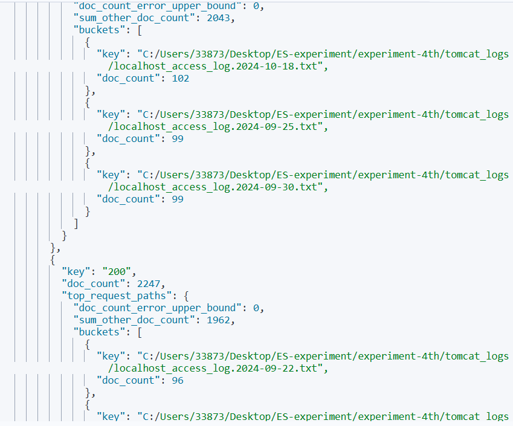
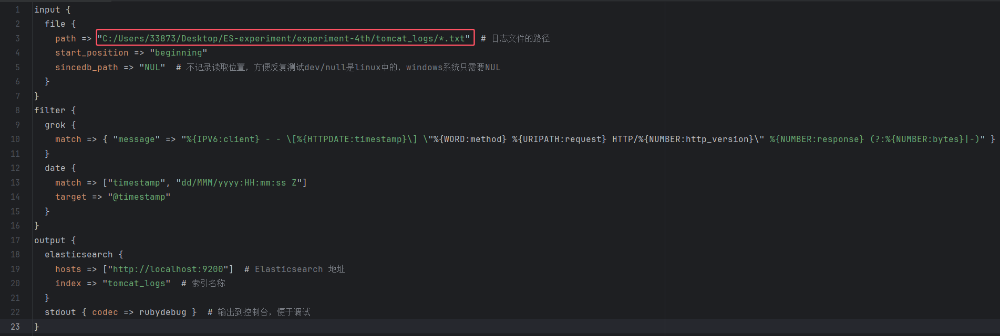

# **实验四 Logstash操作**

> 学院：省级示范性软件学院
> 课程：高级数据库技术与应用
> 题目：《 实验四：Logstash操作》
> 姓名：李小龙
> 学号：2200770141
> 班级：软工2202
> 日期：2024-10-28
> 实验环境： elasticsearch,logstash

 

## 一、实验目的

1. 理解Logstash在数据管道中的作用，以及如何使用它来处理和传输数据。
2. 学会如何将日志文件导入到Elasticsearch中。
3. 掌握Logstash的配置文件编写，以及如何使用它来实现数据的转换和传输。
4. 学习如何在Elasticsearch中进行数据的聚合分析。
5. 了解如何将数据库中的数据同步到Elasticsearch中，并实现数据的自动更新。

## 二、实验内容

### 1.启动elasticsearch:


### 2.启动kibana:


### 3.编写日志处理配置文件：

​	进入到logstash的解压文件夹的config目录，创建一个名为logstash-logs.conf的文件，并且在其中加入对应logstash配置内容。


### 4.运行日志处理配置文件：

​	首先进入到电脑的命令行界面，然后进入到logstash的主目录，在该目录下使用bin\logstash.bat命令来运行logstash-logs.conf配置文件。


### 5.日志处理：

​	（1）查询总请求数和最常出现的3种状态码

```json
//查询总请求数和最常出现的3种状态码。
GET /tomcat_logs/_search
{
  "size": 0,
  "aggs": {
    "total_request": {
      "value_count": {
        "field": "response.keyword"
      }
    },
    "top_ten_status":{
      "terms": {
        "field": "response.keyword",
        "size": 3
      }
    }
  }
}
```

运行结果：


​	（2）查询每小时的总请求数和平均响应时间

```json
//查询每小时的总请求数和平均响应时间
GET /tomcat_logs/_search
{
  "size": 0,
  "aggs": {
    "requests_per_hour": {
      "date_histogram": {
        "field": "@timestamp",
        "calendar_interval": "hour"
      },
      "aggs": {
        "request_count": {
          "value_count": {
            "field": "response_time"
          }
        },
        "average_response_time": {
          "avg": {
            "field": "response_time"
          }
        }
      }
    }
  }
}
```

运行结果：


​	（3）查询显示top3的状态码, 以及每种错误下top3的请求路径

```json
//查询显示top3的状态码, 以及每种错误下top3的请求路径。
GET /tomcat_logs/_search
{
  "size": 0,
  "aggs": {
    "top_status_codes": {
      "terms": {
        "field": "response.keyword",
        "size": 3
      },
      "aggs": {
        "top_request_paths": {
          "terms": {
            "field": "log.file.path.keyword",
            "size": 3
          }
        }
      }
    }
  }
}
```

运行结果：




​	（4）查询使用次数最高的请求方法

```json
//查询使用次数最高的请求方法
GET /tomcat_logs/_search
{
  "size": 0,
  "aggs": {
    "top_methods": {
      "terms": {
        "field": "method.keyword",
        "size": 1
      }
    }
  }
}
```

运行结果：


​	（5）查询特定错误状态码的请求路径和对应的请求次数

```json
//查询特定错误状态码的请求路径和对应的请求次数
GET /tomcat_logs/_search
{
  "size": 0,
  "query": {
    "range": {
      "response.keyword": {
        "gte": "400", 
        "lt": "500" // 仅查找 4xx 错误
      }
    }
  },
  "aggs": {
    "error_requests": {
      "terms": {
        "field": "response.keyword",
        "size": 10
      },
      "aggs": {
        "request_paths": {
          "terms": {
            "field": "log.file.path.keyword",
            "size": 5
          }
        }
      }
    }
  }
}
```

运行结果：


### 6.编写数据传输配置文件：

​	进入到logstash的解压文件夹的config目录，创建一个名为logstash-data-trs.conf的文件，并且在其中加入对应logstash配置内容。


### 7.运行数据传输配置文件：


### 8.在elasticsearch中查询数据：


### 9.同步更新数据：

​	首先在数据库中修改数据。


​	然后在elasticsearch中进行数据的查询。


## 三、问题及解决办法

### 1.日志无法读取：

​	在编写配置文件时，日志文件的读取路径所使用的斜杠为”/“，使用”\“无法读取到日志文件内的内容，导致运行logstash无法创建索引。



### 2.sincedb_path问题：

​	Windows系统中，sincede_path的值要设置为”NUL“，而”dev/null“是Linux中的用法。

