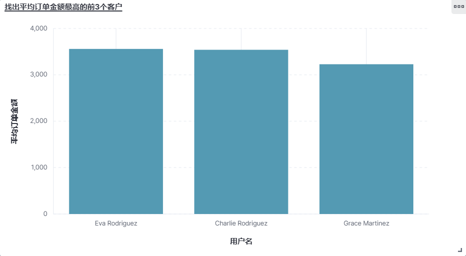

#  《 实验五：**Kibana 操作**》


> **学院：省级示范性软件学院**
>
> **题目：**《 实验五：Kibana 操作》
>
> **姓名：**李小龙
>
> **学号：**2200770141
>
> **班级：**软工2202
>
> **日期：**2024-11-4
>
> **实验环境：** elastic，kibana

## 一、实验目的

​	学会并熟练使用Kibana进行数据的可视化分析。

## 二、实验内容

### 1.修改 Kibana 的配置文件

​	将以下配置信息添加到kibana的配置文件kibana.yml中，保存并退出。

```yml
i18n.locale: "zh-CN"
elasticsearch.hosts: ["http://localhost:9200"]
xpack.encryptedSavedObjects.encryptionKey: 93afe88b7ea1e0014b1499530a7a9103
xpack.reporting.encryptionKey: eff06a6e0db99b7fa5567a79fe776bee
xpack.security.encryptionKey: f0e8568bfaeb9aef848774a7f69d007f
```


### 2.启动elasticsearch


### 3.启动kibana


### 4.创建数据视图

​	进入到elastic点击Discover并创建一个数据视图。


### 5.创建可视化数据表

​	（1）计算每个产品类别的总销售额


​	（2）计算每个城市的平均订单金额


​	（3）找出销量最高的前5个产品


​	（4）计算男性和女性客户的平均年龄


​	（5）统计每种支付方式的使用次数和总金额


​	（6）找出平均订单金额最高的前3个客户



​	（7）计算每个产品类别的平均单价


​	（8）计算男性和女性客户的平均订单金额


​	（9）计算每月的总销售额


​	（10）找出订单数量最多的前5个城市

s

### 6.仪表盘

